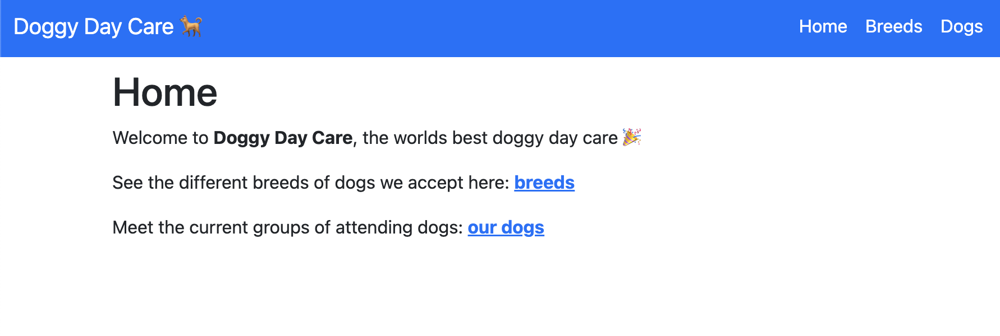
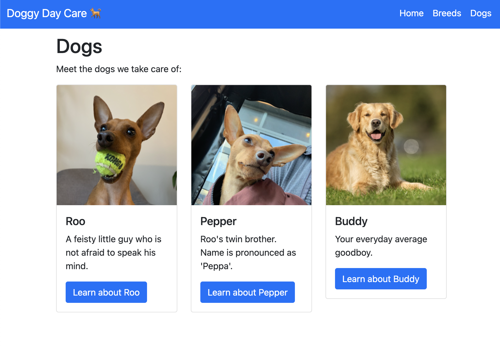
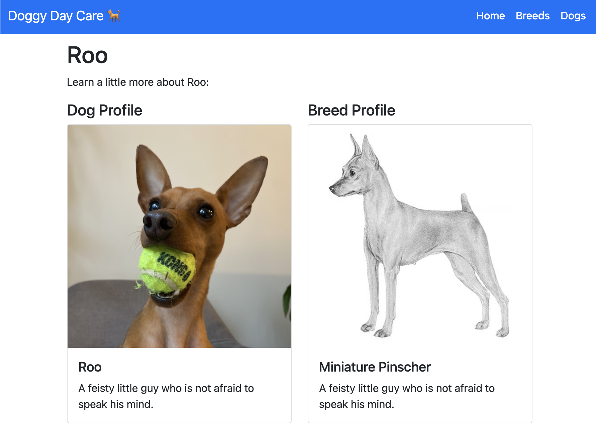

import CodeBlock from '@theme/CodeBlock';
import PythonMain from '!!raw-loader!./main.py';
import TemplateBreeds from '!!raw-loader!./templates/breeds.html';
import TemplateDogs from '!!raw-loader!./templates/dogs.html';
import TemplateDogProfile from '!!raw-loader!./templates/dog_profile.html';
import TemplateLayout from '!!raw-loader!./templates/_layout.html';
import TemplateIndex from '!!raw-loader!./templates/index.html';
import Tabs from '@theme/Tabs';
import TabItem from '@theme/TabItem';

I always like to experiment with the hottest new frameworks and libraries in Python. A few technologies that I have found interesting lately are:

- [FastAPI](https://fastapi.tiangolo.com/) - A framework for building APIs based on [pydantic](https://pydantic-docs.helpmanual.io/).
- [MongoDB](https://www.mongodb.com/) - A NoSQL database.
- [Beanie](https://roman-right.github.io/beanie/) - An "object document mapper" (ODM) that allows you to model your MongoDB using python.

This blog post provides a working example of a webapp that uses **all three** technologies 🎉!

<!--truncate-->

## Motivation

I wanted to create a web app that uses FastAPI, MongoDB, and Beanie. But, I could not find any really good examples that used all three. This blog post is to demonstrate what I learned while building a web app using these three tools. I have tried to make the example simple enough that it can easily be implemented by others, but also complex enough that it is interesting, and could be used to bootstrap a real project for someone else.

All of the code can be found on GitHub: <https://github.com/SamEdwardes/personal-blog/tree/main/blog/2022-03-18-fastapi-beanie-one-page>. You can also download the code as zip file using this link from [DownGit](https://minhaskamal.github.io/DownGit/#/home?url=https://github.com/SamEdwardes/personal-blog/tree/main/blog/2022-03-18-fastapi-beanie-one-page).

In my example we will build a simple web app for **Doggy Day Care**. Here is a preview of the finished product:

**Home page**



**Breeds page**


**Dogs page**



**Dog profile**



## Project setup

### Structure

To start lets create a brand new directory to set up our project in. Then we will create all of the files we need:

```bash
mkdir fastapi-beanie
cd fastapi-beanie
touch requirements.txt main.py
# Set up the template files
mkdir templates
touch templates templates/_layout.html templates/index.html templates/breeds.html templates/dog_profile.html
# Set up the static directory
mkdir static
mkdir static/imgs
mkdir static/imgs/breeds
mkdir static/imgs/dogs
# Download images
curl --create-dirs -O --output-dir static/imgs https://github.com/SamEdwardes/personal-blog/raw/main/blog/2022-03-18-fastapi-beanie-one-page/static/imgs/placeholder_square.jpeg
curl --create-dirs -O --output-dir static/imgs/breeds https://github.com/SamEdwardes/personal-blog/raw/main/blog/2022-03-18-fastapi-beanie-one-page/static/imgs/breeds/golden.png
curl --create-dirs -O --output-dir static/imgs/breeds https://github.com/SamEdwardes/personal-blog/raw/main/blog/2022-03-18-fastapi-beanie-one-page/static/imgs/breeds/min-pin.png
curl --create-dirs -O --output-dir static/imgs/dogs https://github.com/SamEdwardes/personal-blog/raw/main/blog/2022-03-18-fastapi-beanie-one-page/static/imgs/dogs/buddy.png
curl --create-dirs -O --output-dir static/imgs/dogs https://github.com/SamEdwardes/personal-blog/raw/main/blog/2022-03-18-fastapi-beanie-one-page/static/imgs/dogs/pepper.png
curl --create-dirs -O --output-dir static/imgs/dogs https://github.com/SamEdwardes/personal-blog/raw/main/blog/2022-03-18-fastapi-beanie-one-page/static/imgs/dogs/roo.png

```

After running the commands above your project should look like this:

```
.
├── main.py             # This is where your python code will go
├── requirements.txt    # This is where your dependencies are documented
├── static              # A directory that stores images that will be served.
│  └── imgs
│     ├── breeds
│     │  ├── golden.png
│     │  └── min-pin.png
│     ├── dogs
│     │  ├── buddy.png
│     │  ├── pepper.png
│     │  └── roo.png
│     └── placeholder_square.jpeg
└── templates           # Your html files will live in here
   ├── dog_profile.html
   ├── breeds.html
   ├── index.html
   └── _layout.html
```

### Python dependencies

Then lets add our required dependencies to the requirements file:

```bash
echo fastapi > requirements.txt
echo "uvicorn[standard]" >> requirements.txt
echo beanie >> requirements.txt
echo jinja2 >> requirements.txt
```

Lastly, lets create a virtual environment to isolate all of our python dependencies:

<Tabs>
<TabItem value="mac" label="MacOS / Linux" default>

```bash
python -m venv .venv
source .venv/bin/activate
python -m pip install --upgrade pip wheel
pip install -r requirements.txt
```

</TabItem>
<TabItem value="win" label="Windows">

:::warning
Sorry, under development 🤷‍♂️
:::

</TabItem>
</Tabs>

After activating your virtual environment you should have your project all set up and ready to go 🎉

### Installing MongoDB

Below are the instructions on how to install MongoDB for each operating system. You probably want to install the *Community Edition*.

<Tabs>
<TabItem value="mac" label="MacOS">

Run the following commands to install MongoDB:

```bash
# Install the Xcode command-line tools by running the following command in your macOS Terminal
xcode-select --install 

# Install MongoDB
brew tap mongodb/brew
brew install mongodb-community@5.0

# Start MongoDB
brew services start mongodb-community@5.0

# Stop MongoDB
brew services stop mongodb-community@5.0
```

:::note
Check out the official MongoDB docs here: <https://docs.mongodb.com/manual/tutorial/install-mongodb-on-os-x/>
:::


</TabItem>
<TabItem value="win" label="Windows">

:::note
Check out the official MongoDB docs: <https://docs.mongodb.com/manual/tutorial/install-mongodb-on-windows/>
:::

</TabItem>
<TabItem value="lin" label="Linux">

:::note
Check out the official MongoDB docs: <https://docs.mongodb.com/manual/administration/install-on-linux/>
:::

</TabItem>
</Tabs>

## Full code overview

Now that you have all of the dependencies installed you are ready to start coding! Below is the complete code. Take a moment to review the code and see if you can tell what is going on. Then will we will walk through each part in detail and explain what is happening.

<details>
<summary>
<i>main.py:</i> This is where all of our python code lives.
</summary>

<CodeBlock language="python" title="main.py">{PythonMain}</CodeBlock>

</details>

<details>
<summary>
<i>templates/_layout.html:</i> This template is the base template which all others will inherit from. It contains common elements such as the navigation bar and footer. This tutorial will not dive deep into Jinja2 templates, so just take a quick look at this code and then copy it into your project.
</summary>
<CodeBlock language="html" title="templates/_layout.html">{TemplateLayout}</CodeBlock>
</details>

<details>
<summary>
<i>templates/index.html:</i> The template for the home page.
</summary>


<CodeBlock language="html" title="templates/index.html">{TemplateIndex}</CodeBlock>
</details>

<details>
<summary>
<i>templates/breeds.html:</i> The templates for the breeds page.
</summary>


<CodeBlock language="html" title="templates/breeds.html">{TemplateBreeds}</CodeBlock>
</details>

<details>
<summary>
<i>templates/dogs.html:</i> The templates for the dogs page.
</summary>


<CodeBlock language="html" title="templates/dogs.html">{TemplateDogs}</CodeBlock>
</details>

<details>
<summary>
<i>templates/dog_profile.html:</i> The templates for the dog profile page.
</summary>


<CodeBlock language="html" title="templates/dog_profile.html">{TemplateDogProfile}</CodeBlock>
</details>

## Step 1: Define your models with Beanie

One of the cool parts about using Beanie is that you can define your models using Pydantic. In our example app there will be two two classes: `Breed` and `Dog`. In terms of MongoDB each one of these python classes is a **collection**. Each instance of a class is a **document**.

```python
from typing import Optional
from beanie import Document, Link

# --------------------------------------------------------------------------
# Step 1: Define your models with Beanie
# --------------------------------------------------------------------------
class Breed(Document):
    name: str
    description: Optional[str]
    country_of_origin: str
    average_weight: Optional[int]
    image_url: str = "imgs/placeholder_square.jpeg"


class Dog(Document):
    name: str
    description: Optional[str]
    breed: Link[Breed]
    owner: str
    image_url: str = "imgs/placeholder_square.jpeg"
```

Note that there are a few differences between the Beanie models defined above, and a "normal" Pydantic model:

- Each class inherits from `beanie.Document` as opposed to `pydantic.BaseModel`. By inheriting from `beanie.Document` the model will know how to interact with MongoDB.
- The attribute `Dog.breed` is a special kind of attribute in Beanie. The `Link` type tells Beanie to create a relationship between `Dog` and `Breed`. The `Dog.breed` attribute will contain a reference to a `Breed` document.

## Step 2: Create demo data

In order for our app to be interesting we need to fill the MongoDB database with some demo data. The code below creates five documents: two dog breeds, and three dogs. To define a new document you create a new instance of a `Document` class. Then each document is inserted into the database.

```python
# --------------------------------------------------------------------------
# Step 2: Create demo data
# --------------------------------------------------------------------------   
async def create_data():
    """A helper function to insert demo/starter data into your database."""
    # Create some breeds
    min_pin = Breed(
        name="Miniature Pinscher", 
        description="A wee bit crazy 🤪",
        country_of_origin="Germany", 
        average_weight=10,
        image_url="imgs/breeds/min-pin.png"
    )
    
    golden = Breed(
        name="Golden Retriever",
        description="Your everyday average good boy 😇",
        country_of_origin="United States", 
        average_weight=50,
        image_url="imgs/breeds/golden.png"
    )
    
    # Create some dogs
    roo = Dog(
        name="Roo", 
        breed=min_pin, 
        owner="Sam",
        image_url="imgs/dogs/roo.png",
        description="A feisty little guy who is not afraid to speak his mind."
    )
    
    pepper = Dog(
        name="Pepper", 
        breed=min_pin, 
        owner="Allie",
        image_url="imgs/dogs/pepper.png",
        description="Roo's twin brother. Name is pronounced as 'Peppa'."
    )
    
    buddy = Dog(
        name="Buddy", 
        breed=golden, 
        owner="Olivia",
        image_url="imgs/dogs/buddy.png",
        description="Your everyday average good boy."
    )
    
    # Insert data into the database.
    for document in [min_pin, golden, roo, pepper, buddy]:
        await document.insert()
```

:::note
The function is async. This is because beanie only supports async interactions with MongoDB. Therefore, whenever we are interacting with the database it must be async. This could change in the future, but as of March 2022 beanie is ONLY async.
:::

## Step 3: Setup FastAPI and MongoDB database

The next task is to set up our FastAPI app, and initialize our MongoDB database.

```python
from fastapi import FastAPI
from fastapi.staticfiles import StaticFiles
from fastapi.templating import Jinja2Templates
import motor

# --------------------------------------------------------------------------
# Step 3: Setup FastAPI and MongoDB database
# --------------------------------------------------------------------------
app = FastAPI()
app.mount("/static", StaticFiles(directory="static"), name="static")
templates = Jinja2Templates(directory="templates")

@app.on_event("startup")
async def app_init():
    client = motor.motor_asyncio.AsyncIOMotorClient("mongodb://localhost:27017")
    database_names = await client.list_database_names()
    
    if "dogs" not in database_names:
        create_demo_data = True
    else:
        create_demo_data = False
    
    app.db = client.dogs
    await init_beanie(database=app.db, document_models=[Breed, Dog])
    
    if create_demo_data:
        print("Creating demo data...")
        await create_data()
```

Lets dive into the key parts:

```python
from fastapi import FastAPI
from fastapi.staticfiles import StaticFiles
from fastapi.templating import Jinja2Templates
import motor

# --------------------------------------------------------------------------
# Step 3: Setup FastAPI and MongoDB database
# --------------------------------------------------------------------------
app = FastAPI()
# highlight-start
app.mount("/static", StaticFiles(directory="static"), name="static")
templates = Jinja2Templates(directory="templates")
# highlight-end

@app.on_event("startup")
async def app_init():
    client = motor.motor_asyncio.AsyncIOMotorClient("mongodb://localhost:27017")
    database_names = await client.list_database_names()
    
    if "dogs" not in database_names:
        create_demo_data = True
    else:
        create_demo_data = False
    
    app.db = client.dogs
    await init_beanie(database=app.db, document_models=[Breed, Dog])
    
    if create_demo_data:
        print("Creating demo data...")
        await create_data()
```

Create a FastAPI app as your normally would. What may look a little bit less familiar are the highlighted lines above.

- First we mount the directory we created named `static` to our app. This will allow FastAPI to access the files in this directory from the app.
- Second we tell FastAPI where to find our template files. This template files define the UI of our website using the templating language Jinja2.

Next, we define a function that tells that app what do do on start up. This function will be called every time the app starts up (or restarts).

```python
from fastapi import FastAPI
from fastapi.staticfiles import StaticFiles
from fastapi.templating import Jinja2Templates
import motor

# --------------------------------------------------------------------------
# Step 3: Setup FastAPI and MongoDB database
# --------------------------------------------------------------------------
app = FastAPI()
app.mount("/static", StaticFiles(directory="static"), name="static")
templates = Jinja2Templates(directory="templates")

# highlight-start
@app.on_event("startup")
async def app_init():
    client = motor.motor_asyncio.AsyncIOMotorClient("mongodb://localhost:27017")
    database_names = await client.list_database_names()
# highlight-end
    
    if "dogs" not in database_names:
        create_demo_data = True
    else:
        create_demo_data = False
    
    # highlight-start
    app.db = client.dogs
    await init_beanie(database=app.db, document_models=[Breed, Dog])
    # highlight-end

    if create_demo_data:
        print("Creating demo data...")
        await create_data()
```

- Note the function is async. This is because we will be interacting with the MongoDB database.
- First we use `motor` to connect to the MongoDB database. In this case, we are running MongoDB on our local computer. If you were connecting to a cloud instance of MongoDB you would need to change the connection string.
- Next we get a list of all the database names in MongoDB. We do this to check if the "dogs" database has been created yet. If it has not been created, we will insert our demo data. If it has already been created, we will not insert any demo data.

:::note
In a "real" production app you would probably not have any logic here to check if the database has been created already. We put the logic in this app simply because it is a demo app.
:::

- Lastly we call the `init_beanie` function. The key bit here is that we pass a list of `Document` objects. This tells Beanie how to interact with MongoDB database.

## Step 4: Home page

With all our set up complete, now things can start to get fun! All that is left to do is define the routes in our app. Each webpage in our app needs a corresponding function that tells the app what content to send to the web browser. Lets take a look at our homepage function:

```python
from fastapi.responses import HTMLResponse

# --------------------------------------------------------------------------
# Step 4: Home page
# --------------------------------------------------------------------------
@app.get("/", response_class=HTMLResponse)
async def index(request: Request):
    context = {
        "request": request,
    }
    return templates.TemplateResponse("index.html", context)
```

Lets break down the key parts:

```python
from fastapi.responses import HTMLResponse

# --------------------------------------------------------------------------
# Step 4: Home page
# --------------------------------------------------------------------------
# highlight-start
@app.get("/", response_class=HTMLResponse)
# highlight-end
async def index(request: Request):
    context = {
        "request": request,
    }
    return templates.TemplateResponse("index.html", context)
```

- The first argument in `@app.get` is the URL path. Every time a web browser visits the homepage (http://127.0.0.1:8000/) this function will be called.
- Notice that we have defined a `response_class`. By declaring `response_class=HTMLResponse` the docs UI will be able to know that the response will be HTML.

```python
from fastapi.responses import HTMLResponse

# --------------------------------------------------------------------------
# Step 4: Home page
# --------------------------------------------------------------------------
@app.get("/", response_class=HTMLResponse)
# highlight-start
async def index(request: Request):
# highlight-end
    context = {
        "request": request,
    }
    return templates.TemplateResponse("index.html", context)
```

- Our homepage is pretty simple and does not have any query parameters or user input. If you are used to using FastAPI for APIs or using flask you are probably surprised to see `request: Request`. When rendering a template in FastAPI you must send the request object (<https://fastapi.tiangolo.com/advanced/templates/?h=template#using-jinja2templates>).

```python
from fastapi.responses import HTMLResponse

# --------------------------------------------------------------------------
# Step 4: Home page
# --------------------------------------------------------------------------
@app.get("/", response_class=HTMLResponse)
async def index(request: Request):
    # highlight-start
    context = {
        "request": request,
    }
    return templates.TemplateResponse("index.html", context)
    # highlight-end
```

- When you want to return an HTML page, you must return `templates.TemplateResponse`. Remember we defined `templates` further app in `main.py` and told FastAPI where the templates are saved.
- `templates.TemplateResponse` will always take two arguments:
   - The location of the template, relative to the path that you defined above (e.g. `templates = Jinja2Templates(directory="templates")`).
   - The `context` which is a dictionary. It must always contain `"request": request`. For our homepage, there is no other data to pass along, but as you will see in the next pages additional information will be passed to the context. Basically the context must contain any data that your template expects to receive.

## Step 5: Breeds page

Our next view will be a little bit more interesting, here we will pass some additional data into our template to dynamically render HTML for each breed.

```python
# --------------------------------------------------------------------------
# Step 5: Breeds page
# --------------------------------------------------------------------------
@app.get("/breeds", response_class=HTMLResponse)
async def read_item(request: Request):
    breeds = await Breed.find_all().to_list()
    context = {
        "request": request,
        "breeds": breeds
    }
    return templates.TemplateResponse("breeds.html", context)
```

The first few lines look pretty similar to the homepage. Again we must define `response_class=HTMLResponse` and `request: Request`. What is new this time is the additional key value pair that we have passed into the `context`. 

Lets take a closer look at the template to see what is going on:

<CodeBlock language="html" title="templates/breeds.html">{TemplateBreeds}</CodeBlock>

I won't dive into the Jinja2 syntax in this blog post, but hopefully it is easy enough to see what is happening. The template is expecting a variable named `breeds`. It then loops over that variable and for each breed creates a Bootstrap Card component.

Because the template is expecting a variable named `breeds`, we must pass it into the context.

```python
# --------------------------------------------------------------------------
# Step 5: Breeds page
# --------------------------------------------------------------------------
@app.get("/breeds", response_class=HTMLResponse)
async def read_item(request: Request):
    breeds = await Breed.find_all().to_list()
    # highlight-start
    context = {
        "request": request,
        "breeds": breeds
    }
    return templates.TemplateResponse("breeds.html", context)
    # highlight-end
```

## Step 6: Dogs page

In our next view we add an additional layer of complexity. The `/dogs` view includes an optional query parameter `breed_id`. If a `breed_id` is provided the page will only render all the dogs of that specific breed:

```
http://127.0.0.1:8000/dogs?breed_id=62408cc988015b2618098bbf
```

Otherwise, it will render all of the dogs.

```
http://127.0.0.1:8000/dogs
```

Lets take a closer look at the function:

```python
# --------------------------------------------------------------------------
# Step 6: Dogs page
# --------------------------------------------------------------------------
@app.get("/dogs", response_class=HTMLResponse)
async def read_item(request: Request, breed_id: Optional[str] = None):
    if breed_id:
        breed = await Breed.get(breed_id)
        dogs = await Dog.find( Dog.breed._id == breed.id, fetch_links=True).to_list()
    else:
        breed = None
        dogs = await Dog.find_all().to_list()
    context = {
        "request": request,
        "dogs": dogs,
        "breed": breed
    }
    return templates.TemplateResponse("dogs.html", context)
```

In the function definition we have provided an argument named `breed_id`.

```python
# --------------------------------------------------------------------------
# Step 6: Dogs page
# --------------------------------------------------------------------------
@app.get("/dogs", response_class=HTMLResponse)
# highlight-start
async def read_item(request: Request, breed_id: Optional[str] = None):
# highlight-end
    if breed_id:
        breed = await Breed.get(breed_id)
        dogs = await Dog.find( Dog.breed._id == breed.id, fetch_links=True).to_list()
    else:
        breed = None
        dogs = await Dog.find_all().to_list()
    context = {
        "request": request,
        "dogs": dogs,
        "breed": breed
    }
    return templates.TemplateResponse("dogs.html", context)
```

FastAPI is really good at figuring out what each argument means. In this case, it automatically determines that the `breed_id` is a query parameter. It also knows that it is optional because we have used the `Optional` type. See <https://fastapi.tiangolo.com/tutorial/query-params/#query-parameters> for an explanation on how FastAPI decides if an argument is a query parameter or path parameter:

> When you declare other function parameters that are not part of the path parameters, they are automatically interpreted as "query" parameters.

```python
# --------------------------------------------------------------------------
# Step 6: Dogs page
# --------------------------------------------------------------------------
@app.get("/dogs", response_class=HTMLResponse)
async def read_item(request: Request, breed_id: Optional[str] = None):
    # highlight-start
    if breed_id:
        breed = await Breed.get(breed_id)
        dogs = await Dog.find( Dog.breed._id == breed.id, fetch_links=True).to_list()
    else:
        breed = None
        dogs = await Dog.find_all().to_list()
    # highlight-end
    context = {
        "request": request,
        "dogs": dogs,
        "breed": breed
    }
    return templates.TemplateResponse("dogs.html", context)
```

In this code snippet we apply the logic to determine which dogs to get from the database. If no `breed_id` is specified we get all of the dogs.

```python
# --------------------------------------------------------------------------
# Step 6: Dogs page
# --------------------------------------------------------------------------
@app.get("/dogs", response_class=HTMLResponse)
async def read_item(request: Request, breed_id: Optional[str] = None):
    if breed_id:
        breed = await Breed.get(breed_id)
        dogs = await Dog.find( Dog.breed._id == breed.id, fetch_links=True).to_list()
    else:
        breed = None
        dogs = await Dog.find_all().to_list()
    # highlight-start
    context = {
        "request": request,
        "dogs": dogs,
        "breed": breed
    }
    return templates.TemplateResponse("dogs.html", context)
    # highlight-end
```

Lastly, as with the above views we create our context dictionary. This context has three key value pairs:

1. The required request object that must always be returned.
2. A list of dog objects.
3. An optional breed object.

Note that the template applies conditional logic to only render the breeds name if the breed is not `None`.

<CodeBlock language="html" title="templates/dogs.html">{TemplateDogs}</CodeBlock>

## Step 7: Dog page

In our web app each dog has it's very own profile page. Here we take a new approach and use a path parameter:

```python
# --------------------------------------------------------------------------
# Step 7: Dog page
# --------------------------------------------------------------------------
@app.get("/dogs/{dog_id}", response_class=HTMLResponse)
async def read_item(dog_id: str, request: Request):
    dog = await Dog.get(dog_id, fetch_links=True)
    context = {
        "request": request,
        "dog": dog
    }
    return templates.TemplateResponse("dog_profile.html", context)
```

Like we said above, FastAPI is really smart at determining if an argument is a path parameter or a query parameter.

```python
# --------------------------------------------------------------------------
# Step 7: Dog page
# --------------------------------------------------------------------------
# highlight-start
@app.get("/dogs/{dog_id}", response_class=HTMLResponse)
async def read_item(dog_id: str, request: Request):
# highlight-end
    dog = await Dog.get(dog_id, fetch_links=True)
    context = {
        "request": request,
        "dog": dog
    }
    return templates.TemplateResponse("dog_profile.html", context)
```

In this case, FastAPI knows that it is a path parameter because we have defined `{dog_id}` in our views url path, and we have used the same string `dog_id` in our function definition. Because the two values are the same, FastAPI knows they related to one another.

:::tip
The order does not matter. FastAPI knows that `dog_id` is a path parameter because we also have a `{dog_id}` in our URL path. See <https://fastapi.tiangolo.com/tutorial/path-params/> for more info.
:::

```python
# --------------------------------------------------------------------------
# Step 7: Dog page
# --------------------------------------------------------------------------
@app.get("/dogs/{dog_id}", response_class=HTMLResponse)
async def read_item(dog_id: str, request: Request):
# highlight-start
    dog = await Dog.get(dog_id, fetch_links=True)
    context = {
        "request": request,
        "dog": dog
    }
    return templates.TemplateResponse("dog_profile.html", context)
# highlight-end
```

Just like before, we query the database, and then return our context dictionary. This time the context only includes the required request object and a single dog object. The template will render a nice profile page for each dog.

<CodeBlock language="html" title="templates/dog_profile.html">{TemplateDogProfile}</CodeBlock>

## Wrap up

Congratulations! You just built a fully functional and asynchronous web app using FastAPI, Beanie, and MongoDB 🎉. This app was pretty basic, but is a good starting point for developing something more complex and interesting. Here are a few ideas on how you could extend the app:

- Refactor the code into more than one file (e.g. not all the code needs to live in `main.py`).
- Add a forms so that the users can add new breeds and new dogs.

## Further learning

Check out these useful resources for learning more about MongoDB, FastAPI, and Beanie.

- <https://fastapi.tiangolo.com/>
- <https://roman-right.github.io/beanie/>
- <https://realpython.com/introduction-to-mongodb-and-python/#installing-and-running-mongodb>