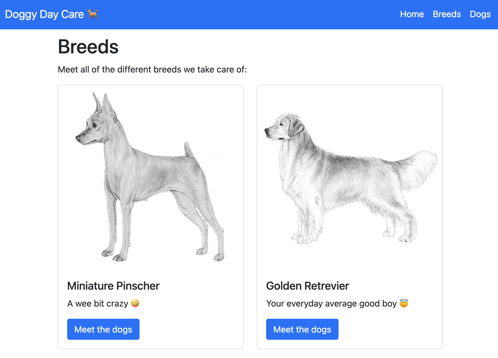

import CodeBlock from '@theme/CodeBlock';
import PythonMain from '!!raw-loader!./main.py';
import Tabs from '@theme/Tabs';
import TabItem from '@theme/TabItem';

:::caution
This blog post is a work in progress and will be updated!
:::

I always like to experiment with the hottest new frameworks and libraries in Python. A few technologies that I have found interesting lately are:

- [FastAPI](https://fastapi.tiangolo.com/) - A framework for building APIs based on [pydantic](https://pydantic-docs.helpmanual.io/).
- [MongoDB](https://www.mongodb.com/) - A NoSQL database.
- [Beanie](https://roman-right.github.io/beanie/) - An "object document mapper" (ODM) that allows you to model your MongoDB using python.

This blog post provides a working example of a webapp that uses **all three** technologies 🎉!

<!--truncate-->

## Motivation

I wanted to create a web app that uses FastAPI, MongoDB, and Beanie. But, I could not find any really good examples that used all three. This blog post is to demonstrate what I learned while building a web app using these three tools. I have tried to make the example simple enough that it can easily be implemented by others, but also complex enough that it is interesting, and could be used to bootstrap a real project for somone else.

All of the code can be found on GitHub: <https://github.com/SamEdwardes/personal-blog/tree/main/blog/2022-03-18-fastapi-beanie-one-page>.

In my example we will build a simple web app for **Doggy Day Care**. The app could be used by the day cares customers to see what other dogs attend the day care! here is a preview of the finished product:



## Project setup

### Structure

To start lets create a brand new directory to set up our project in. Then we will create all of the files we need:

```bash
mkdir fastapi-beanie
cd fastapi-beanie
touch requirements.txt main.py
mkdir templates
touch templates templates/layout.html templates/index.html templates/breeds.html
```

After running the commands above your project should look like this:

```
.
├── main.py             # This is where your python code will go
├── requirements.txt    # This is where your dependencies are documented
├── static              # A directory that stores images that will be served.
│  └── imgs
│     ├── breeds
│     │  ├── golden.png
│     │  └── min-pin.png
│     ├── dogs
│     │  ├── buddy.png
│     │  ├── pepper.png
│     │  └── roo.png
│     └── placeholder_square.jpeg
└── templates           # Your html files will live in here
   ├── breeds.html
   ├── index.html
   └── layout.html
```

### Python dependencies

Then lets add our required dependencies to the requirements file:

```bash
echo fastapi > requirements.txt
echo "uvicorn[standard]" >> requirements.txt
echo beanie >> requirements.txt
echo jinja2 >> requirements.txt
```

Lastly, lets create a virtual environment to isolate all of our python dependencies:

<Tabs>
<TabItem value="mac" label="MacOS / Linux" default>

```bash
python -m venv .venv
source .venv/bin/activate
python -m pip install --upgrade pip wheel
pip install -r requirements.txt
```

</TabItem>
<TabItem value="win" label="Windows">

:::warning
Sorry, under development 🤷‍♂️
:::

</TabItem>
</Tabs>


After activating your virutal environemnt you should have your project all set up and ready to go 🎉

### Installing mongodb

Below are the instructions on how to install MongoDB for each operating system. You probably want to install the *Community Edition*.

<Tabs>
<TabItem value="mac" label="MacOS">

:::note
Check out the official MongoDB docs here: <https://docs.mongodb.com/manual/tutorial/install-mongodb-on-os-x/>
:::

<details>
<summary><b>TL/DR</b></summary>

```bash
# Install the Xcode command-line tools by running the following command in your macOS Terminal
xcode-select --install 

# Install MongoDB
brew tap mongodb/brew
brew install mongodb-community@5.0

# Start MongoDB
brew services start mongodb-community@5.0

# Stop MongoDB
brew services stop mongodb-community@5.0
```

</details>

</TabItem>
<TabItem value="win" label="Windows">

:::note
Check out the official MongoDB docs: <https://docs.mongodb.com/manual/tutorial/install-mongodb-on-windows/>
:::

</TabItem>
<TabItem value="lin" label="Linux">

:::note
Check out the official MongoDB docs: <https://docs.mongodb.com/manual/administration/install-on-linux/>
:::

</TabItem>
</Tabs>

## MongoDB

## FastAPI

## Full code

<CodeBlock className="language-jsx" title="main.py">{PythonMain}</CodeBlock>

## Further learning

Check out these useful resources for learning more about MongoDB, FastAPI, and Beanie!

- <https://realpython.com/introduction-to-mongodb-and-python/#installing-and-running-mongodb>