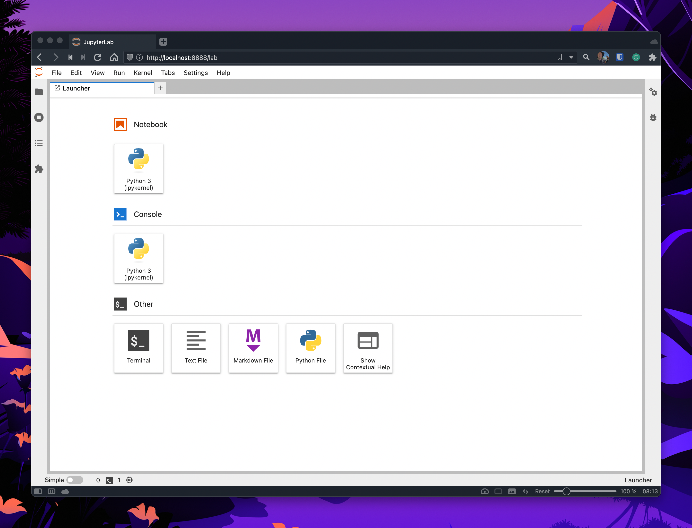
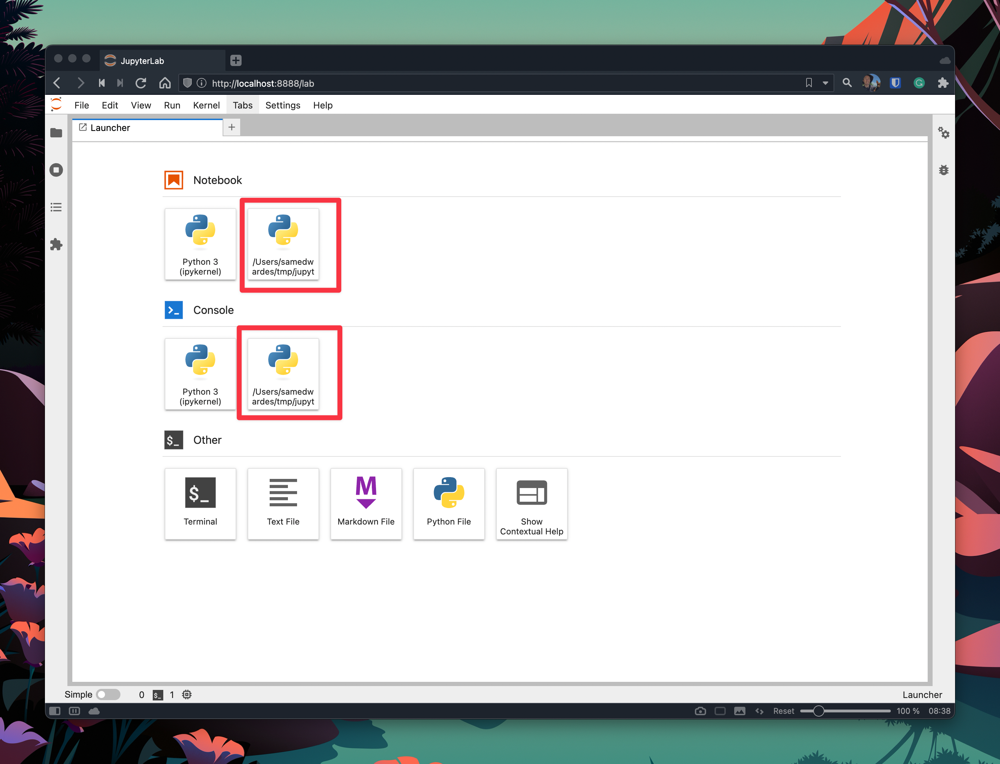

import Tabs from '@theme/Tabs';
import TabItem from '@theme/TabItem';

Installing and managing your Python environment can be tricky, as this famous [XKCD](https://xkcd.com/1987/) comic has aptly pointed out. After many years of experimentation, here is my advice on the best way to install Jupyter Lab (and notebook). 


<!--truncate-->

## TL/DR

Use [pipx](https://pypa.github.io/pipx/) to manage your installation of Jupyter Lab.

```bash
# install pipx
brew install pipx
pipx ensurepath

# install jupyterlab
pipx install jupyterlab --include-deps
pipx ensurepath

# add common dependencies
pipx inject jupyterlab pandas
pipx ensurepath

# start jupyterlab
jupyter-lab
```

## The basic approach

 The official Jupyter Lab installation [instructions](https://jupyter.org/install) are simple:

```bash
pip install jupyterlab
jupyter-lab
```

These instructions work for getting started. However, as your number of Python projects grows, so will the complexity of your environment. Consider this:

- When you called `pip install jupyterlab`, where on your computer was it installed?
- Which version of Python was it installed using?
- What other dependencies are in the environment for which I installed it?
- How can I access the other tools that come along with Jupyter Lab, like ipython?

## The strategic approach

After dealing with Jupyter Lab installations on several computers, I have come up with an approach that works best for me. I use pipx to install Jupyter Lab in an isolated environment that I can re-use every time I need to use Jupyter Lab or another Jupyter tool (e.g. ipython).

### Why use pipx?

First of all, what is [pipx](https://pypa.github.io/pipx)?

> pipx is a tool to help you install and run end-user applications written in Python. It's roughly similar to macOS's brew, JavaScript's npx, and Linux's apt.
>
> It's closely related to pip. In fact, it uses pip, but is focused on installing and managing Python packages that can be run from the command line directly as applications.

Typically you want to use pipx for tools you want to use across a variety of projects. For example:

- [black](https://github.com/psf/black)
- [asciinema](https://asciinema.org)
- and many others! See <https://pypa.github.io/pipx/programs-to-try/>

Pipx creates isolated environments to run these Python applications. You only need to install the specific Python application once. Then you can run it on all of your projects.

### Why install jupyterlab with pipx?

When installing Jupyter Lab, there are several outcomes I wanted:

- I want only to install Jupyter Lab once (e.g. not for each virtual environment).
- I want the environment to be easy to manage (e.g. upgrading Jupyter Lab, adding and removing dependencies).
- I want to easily access the other command line tools installed with Jupyter Lab, such as `jupyter` and `ipython`. I also only want to install these tools once.
- I want to use this environment to render [Quarto](https://quarto.org) projects and [Jupyter Book](https://jupyterbook.org/en/stable/intro.html) projects.

### Step 1: install pipx

Install pipx by following the instructions here: <https://pypa.github.io/pipx/installation/>.

<Tabs>
<TabItem value="mac" label="macOS">

```bash
brew install pipx
pipx ensurepath
```

</TabItem>
<TabItem value="windows" label="Windows">

```bash
python -m pip install --user pipx
python -m pipx ensurepath
```

</TabItem>
</Tabs>

### Step 2: Install Jupyter Lab with pipx

Install Jupyter Lab using pipx:

```bash
pipx install jupyterlab --include-deps
pipx ensurepath
```

I have chosen to use the `--include-deps` flag. This flag will install the apps for all of the dependencies of jupyterlab that I also want to expose. For example, if I were to install without the `--include-deps` flag, I would only get access to four commands:

```bash
pipx install jupyterlab
pipx ensurepath
pipx list
# venvs are in /Users/samedwardes/.local/pipx/venvs
# apps are exposed on your $PATH at /Users/samedwardes/.local/bin
#    package jupyterlab 3.4.5, installed using Python 3.10.5
#     - jlpm
#     - jupyter-lab
#     - jupyter-labextension
#     - jupyter-labhub
```

If I install it with the flag, I get access to many more. For me, this behaviour is desirable because I want to be able to access commands like `ipython` and `jupyter`.

```bash
pipx install jupyterlab
pipx ensurepath
pipx list
# venvs are in /Users/samedwardes/.local/pipx/venvs
# apps are exposed on your $PATH at /Users/samedwardes/.local/bin
#    package jupyterlab 3.4.5, installed using Python 3.10.5
#     - ipython
#     - ipython3
#     - jlpm
#     - jsonschema
#     - jupyter
#     - jupyter-bundlerextension
#     - jupyter-dejavu
#     - jupyter-execute
#     - jupyter-kernel
#     - jupyter-kernelspec
#     - jupyter-lab
#     - jupyter-labextension
#     - jupyter-labhub
#     - jupyter-migrate
#     - jupyter-nbclassic
#     - jupyter-nbclassic-bundlerextension
#     - jupyter-nbclassic-extension
#     - jupyter-nbclassic-serverextension
#     - jupyter-nbconvert
#     - jupyter-nbextension
#     - jupyter-notebook
#     - jupyter-run
#     - jupyter-server
#     - jupyter-serverextension
#     - jupyter-troubleshoot
#     - jupyter-trust
#     - normalizer
#     - pybabel
#     - pygmentize
#     - pyjson5
#     - send2trash
#     - wsdump
```

:::tip
The other commands are installed whether you use `--include-deps` or not. The difference is that when I use `--include-deps`, these other commands are also added to the `PATH`.
:::

### Step 3: install common dependencies (optional)

If there are some dependencies that you use very often, it may also be helpful to install these dependencies in your pipx Jupyter Lab environment. For example, I use the [pandas](https://pandas.pydata.org) package daily. To avoid creating a virtual environment, I will "inject" my Jupyter Lab environment with pandas. Then, I can import pandas when I launch Jupyter Lab and use the default kernel or launch the ipython REPL.

```bash
pipx inject jupyterlab pandas
pipx ensurepath
```

I would recommend using the `pipx inject` command sparingly. If you have a bunch of dependencies you need to add, it may make sense to create a virtual environment instead.

### Step 4: start Jupyter Lab

You can now launch Jupyter Lab using the following:

```bash
jupyter-lab
```



## Virtual environments

Hopefully, my strategic approach will cover much of your Jupyter Lab usage. However, you will likely still want to create virtual environments to isolate your project for projects. Instead of adding Jupyter Lab into the virtual environment, I recommend still using the Jupyter Lab you installed with pipx.

### Create a new virtual environment

First, create and activate a new virtual environment:

```bash
python -m venv venv
source venv/bin/activate
python -m pip install --upgrade pip wheel setuptools
```

Next, install the dependencies you require:

```bash
pip install pandas spacy matplotlib
```

Lastly, you will need to pip install ipykernel and install a new kernel. Ipykernel is the only dependency we need to add to our virtual environment related to Jupyter. Note that you do not need to add Jupyter Lab.

### Install a new kernel

Before installing ipykernel, let's first look at the current state of our environment:

```bash
jupyter kernelspec
# Available kernels:
#   python3    /Users/samedwardes/.local/pipx/venvs/jupyterlab/share/jupyter/kernels/python3
```

As you can see, we currently have only one kernel registered with Jupyter Lab. After we install a new one, we should see two:

```bash
pip install ipykernel
python -m ipykernel install --user --display-name ${PWD} --name ${PWD##*/}
# Installed kernelspec jupyter-blob-test in /Users/samedwardes/Library/Jupyter/kernels/jupyter-blob-test
jupyter kernelspec list
# Available kernels:
#   jupyter-blob-test    /Users/samedwardes/Library/Jupyter/kernels/jupyter-blob-test
#   python3              /Users/samedwardes/.local/pipx/venvs/jupyterlab/share/jupyter/kernels/python3
```

:::tip
Notice how I used `--display-name ${PWD}` and `--name ${PWD##*/}`. These flags do two things:

- `--display-name ${PWD}` sets the name you see in the Jupyter Lab user interface to the name of my projects directory. I like this for helping me stay organized. I want to know if this kernel is associated with this project. I can delete the kernel once the project is complete.
- `--name ${PWD##*/}` sets the "actual name" of the kernel to my current directory. `--name` is the name you see when you call `jupyter kernelspec list`. Again, I do this to try and make it easy for me to keep track of and manage my kernels.
:::

When you start Jupyter Lab again, you will also see two kernels to choose from:

```bash
jupyter-lab
```



### Delete the kernel

You can safely delete your kernel once your project is complete and you think you will no longer need to use it. First double, check the names of the kernels you currently have installed:

```bash
jupyter kernelspec list
# Available kernels:
#   jupyter-blob-test    /Users/samedwardes/Library/Jupyter/kernels/jupyter-blob-test
#   python3              /Users/samedwardes/.local/pipx/venvs/jupyterlab/share/jupyter/kernels/python3
```

Then remove the kernel:

```bash
jupyter kernelspec uninstall jupyter-blob-test
# [RemoveKernelSpec] Removed /Users/samedwardes/Library/Jupyter/kernels/jupyter-blob-test
jupyter kernelspec list
# Available kernels:
#   python3    /Users/samedwardes/.local/pipx/venvs/jupyterlab/share/jupyter/kernels/python3
```