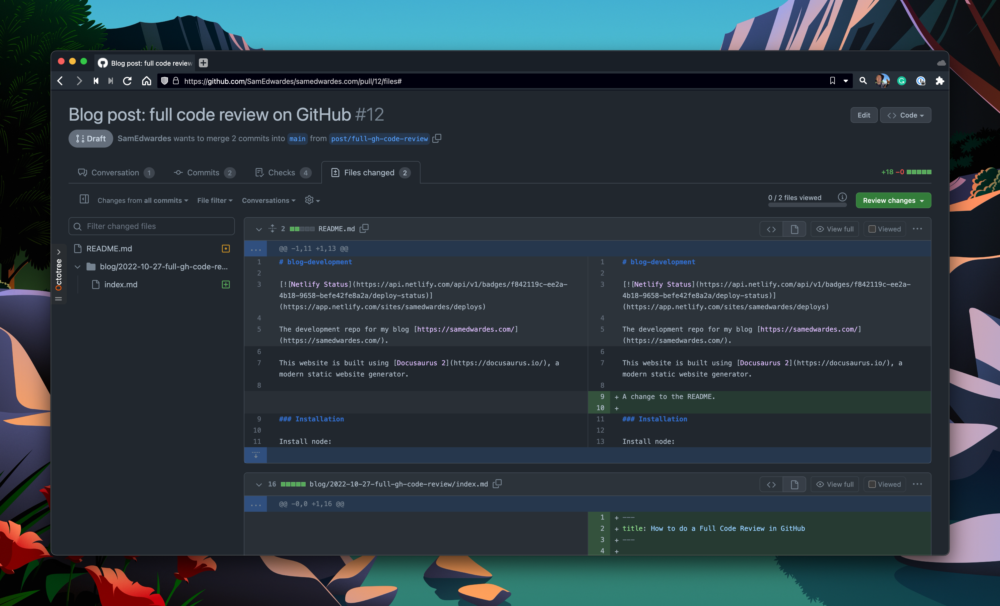
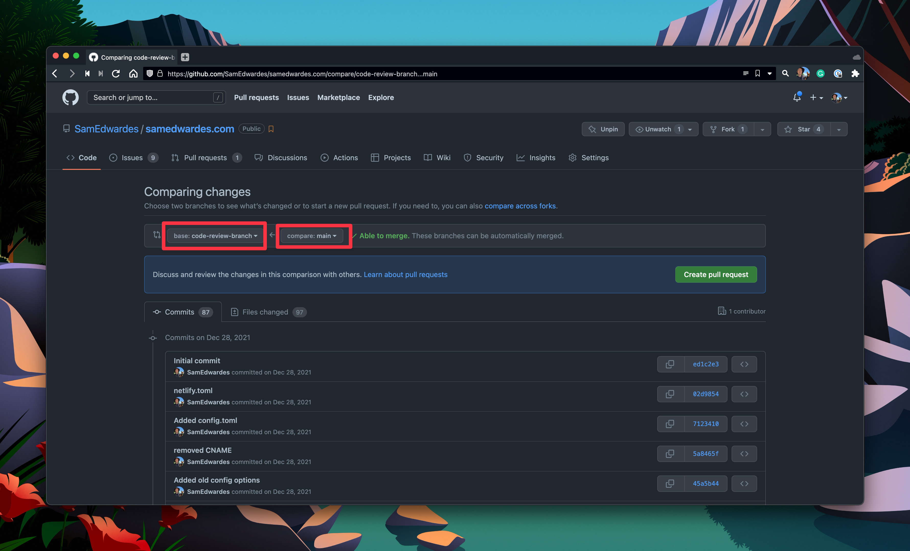
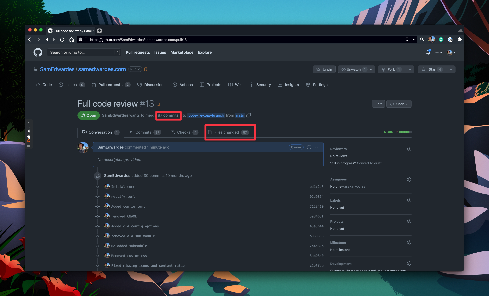
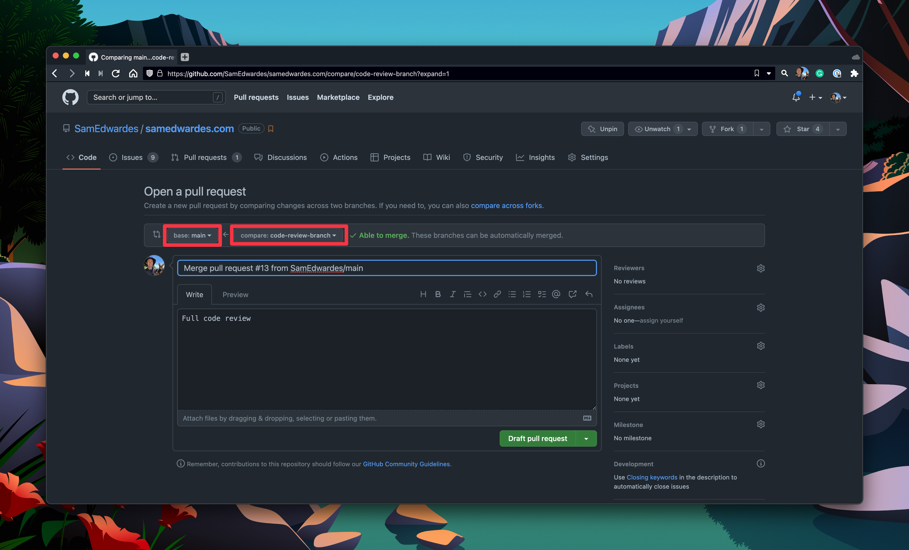

GitHub has a friendly UI for performing code reviews. However, it only allows you to leave comments on the changed code. It does not allow you to leave comments or suggestions on existing code. <!--truncate--> In the screenshot below, GitHub will only let me leave comments and suggestions on lines 6-13. I cannot suggest lines 1-5, even if I notice a typo or an error.



It would be great if there is a way you could leave comments and suggestions on any line of code, all in the same code review!

## Create a new branch

It is possible to do a "full code" review in GitHub. I classify the solution as a bit "hacky" because you need to create some extra branches and reset the history of those branches. However, the solution is relatively simple and safe! Here is how you do it:

```bash
# Check out the main branch.
git checkout main
git pull

# Create a new branch to do the full code review.
git checkout -b code-review-branch

# Reset to an earlier point in time if you want to review the entire code base
# reset to the first commit hash.
git reset --hard b5353546631c97dfa82f6b1be10c4767868066a0
git push --set-upstream origin code-review-branch
```

## Perform the code review

Then, in the GitHub UI, create a pull request to merge `main` into `code-review-branch`.



This new pull request will allow you to review all of your code! As far as git is concerned, you are merging all of your previous code into an empty branch.



As you can see in the screenshot above, GitHub now says I have 97 files that have changed and 87 commits to merge. Perform your code review. Then merge `main` into `code-review-branch`.

## Merge back into main

Lastly, we want to merge the code review back into main. Create a pull request to merge `code-review-branch` back into `main`.



After merging the pull request, remember to pull the latest commits from main back to your computer.

```bash
git checkout main
git pull
```

