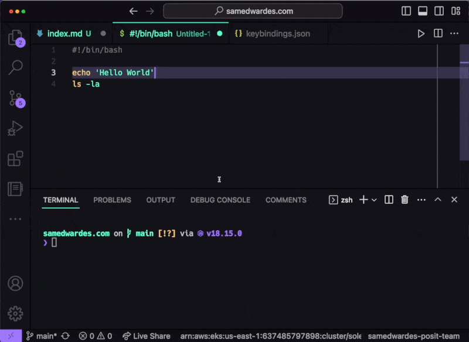

VS Code has a built in feature that allows you to send code directly from the editor to the terminal. By default, it is not assigned to any shortcut. You can assign it to a shortcut by adding the following to your `keybindings.json` file.

- Open the command pallet using **cmd** + **shift** + **p**.
- Type `Preferences: Open Keyboard Shortcuts (JSON)`
- Then edit the `keybindings.json` file:

```json
[
    // Send selected bash code to terminal
    {
        "key": "shift+enter",
        "command": "workbench.action.terminal.runSelectedText",
        "when": "editorTextFocus && !findInputFocussed && !replaceInputFocussed && editorLangId == 'shellscript'"
    }
]
```

The `when` key ensures that this shortcut is only active when you are working on a Shell Script file. Here is an example of the shortcut in action.

