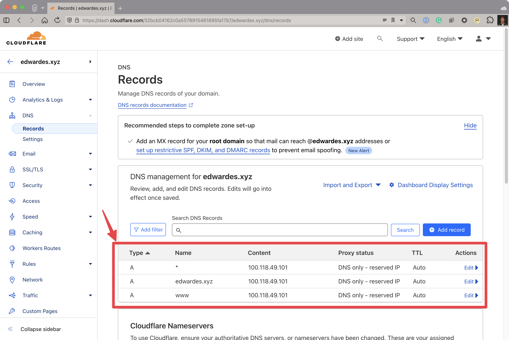
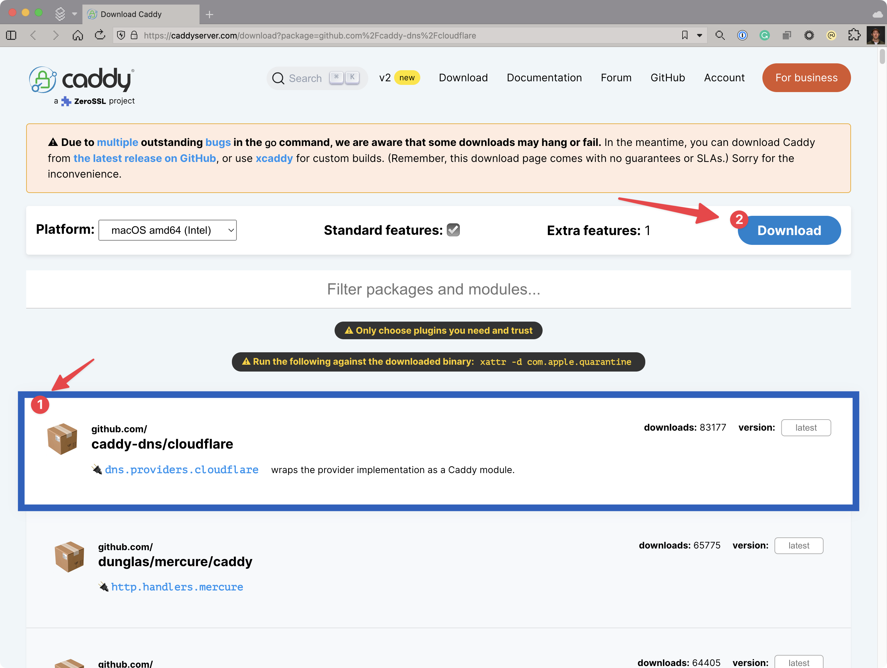
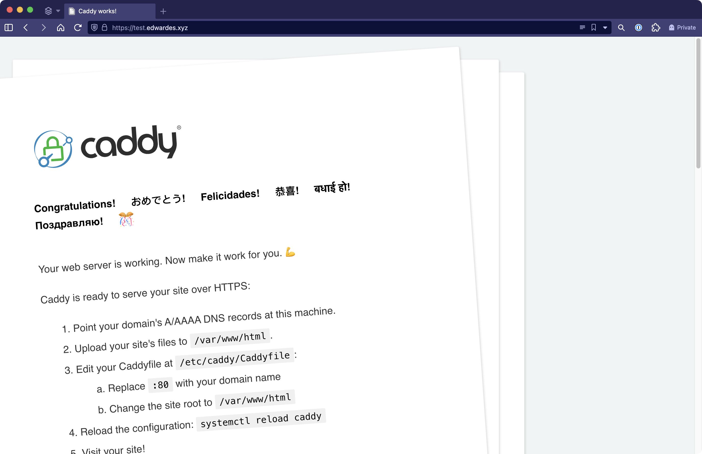

[Caddy](https://caddyserver.com) and [Cloudflare](https://www.cloudflare.com/application-services/products/dns/) make it easy to get TLS certificates for your homelab. In this blog post I will walk you through how to set up Caddy and Cloudflare for automated TLS!

<!--truncate-->

## Getting started

To get started, you will need a few things:

- A domain name that you own. I used Cloudflare to purchase `edwardes.xyz`.
- A Cloudflare account (free!).
- A server to run Caddy on (your homelab!)

## Setting up Cloudflare DNS

Cloudflare provides a free DNS service. We will use this service to create DNS records that will point all of our homelab traffic to Caddy. If you purchased your domain name through Cloudflare, you are almost done already!

If you purchased your domain through another provider you will need to manually configure Cloudflare to be your DNS provider. Here are a few examples:

- Namecheap: <https://www.namecheap.com/support/knowledgebase/article.aspx/9607/2210/how-to-set-up-dns-records-for-your-domain-in-cloudflare-account/>
- GoDaddy: <https://blog.softbinator.com/set-up-cloudflare-dns-godaddy-domains/>

The key is that you need to tell your domain registrar to use Cloudflare's DNS servers by changing your domain's nameservers to the nameservers for Cloudflare. One advantage of buying the domain through Cloudflare is that this step is done for you automatically.

Lastly, set up the required DNS records to point to the internal IP address of your homelab server. Replace "Name" with your domain name, and replace "Content" with your internal IP address.



:::note
This may seem a bit strange. How will Cloudflare no what to do with `100.118.49.101`? This is an internal IP address that is only accessible from within your homelab. The trick is that Cloudflare does not care! We just need the DNS name `edwardes.xyz` to resolve to this IP address. When I am on my home network it will resolve to my server hosting Caddy. When I am not inside my home network it will still resolve to `100.118.49.101`, but this IP address will mean nothing to the outside world.
:::


## Setting up Caddy

Next we will install Caddy in our homelab. Caddy is able to automatically provision HTTPS certificates for you. If you have public facing website, you can do with with very little configuration. Since we are setting up private services in our homelab we have a little bit of extra work to do. You will need to install Caddy with the CloudFlare module <https://github.com/caddy-dns/cloudflare>.

1. Get the URL to download Caddy with the Cloudflare module already enabled. To get the URL for this, go to <https://caddyserver.com/download?package=github.com%2Fcaddy-dns%2Fcloudflare>. Make sure you have `caddy-dns/cloudflare` selected in the list of plugins and that you have selected your desired operating system from the **Platform** dropdown.  h Copy the URL for the download.



2. Install Caddy in your homelab.

```bash
# Download Caddy with the Cloudflare module
sudo curl -o /usr/bin/caddy "https://caddyserver.com/api/download?os=linux&arch=arm64&p=github.com%2Fcaddy-dns%2Fcloudflare&idempotency=65109249937188"

# Make Caddy executable
sudo chmod 755 /usr/bin/caddy

# Verify that Caddy is installed
caddy --version
```

3. Configure Caddy to serve the Caddy docs.

```bash
# Create a directory for Caddy's configuration
sudo mkdir /etc/caddy

# Create a configuration file
sudo tee /etc/caddy/Caddyfile <<EOF
test.edwardes.xyz {
	# Set this path to your site's directory.
	root * /usr/share/caddy

	# Enable the static file server.
	file_server

	tls {
		dns cloudflare {env.CLOUDFLARE_API_TOKEN}
	}
}
EOF
```

:::note
This section is the crux of the configuration:

```caddy
	tls {
		dns cloudflare {env.CLOUDFLARE_API_TOKEN}
	}
```

Caddy will use the Cloudflare module for the ACME DNS challenge. This is required because our homelab server is not publicly accessible.
:::

4. Create an API token in Cloudflare that has the permissions to manage DNS records for your site.
5. Set the `CLOUDFLARE_API_TOKEN` environment variable and start Caddy.

```bash
export CLOUDFLARE_API_TOKEN="your-api-token"
caddy run --config /etc/caddy/Caddyfile --adapter
```

6. Verify that Caddy is running and that you can access the Caddy docs at `https://test.edwardes.xyz`. Note that if you have just set up the DNS records it could take a while before this works. When I first set this up it took about 2 hours. You can check if the DNS name is correctly resolving with `nslookup`.

```bash
$ nslookup test.edwardes.xyz
Server:         100.100.100.100
Address:        100.100.100.100#53

Non-authoritative answer:
Name:   edwardes.xyz
Address: 100.118.49.101
```



## Reference

I found these resources helpful when setting up automated TLS:

- <https://notthebe.ee/blog/easy-ssl-in-homelab-dns01/>
- <https://caddyserver.com/download?package=github.com%2Fcaddy-dns%2Fcloudflare>
- <https://samjmck.com/en/blog/using-caddy-with-cloudflare/>
- <https://github.com/caddy-dns/cloudflare>
- <https://vakarthik.com/posts/2021/compiling-and-building-caddy/>