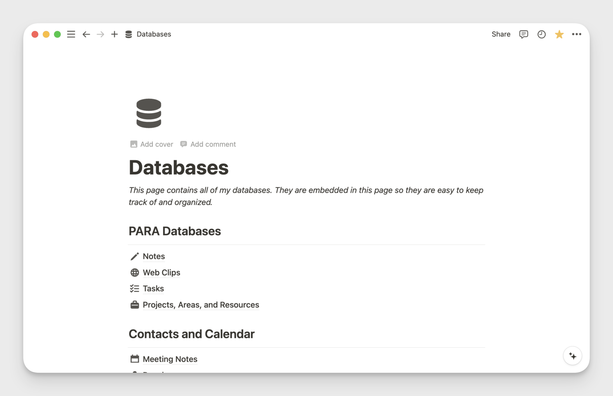

I am a big fan of Notion. I use it as my second brain, and I follow the [PARA](https://fortelabs.com/blog/para/) method to organize everything. One of my Notion databases is called "Web Clips". I use this database to save links that I find on the web.



I wanted a way to share some of these links that I collect on my blog. I had a few options I was considering:

- I could make this Notion database public. But some links I want to keep private. So this was not a good option.
- I could use the [Notion API](https://developers.notion.com/docs/getting-started) to dynamically render all of the links I want to show. This is a lot of work, but that is what this blog is for.

## Project Elements

I would need to build a few things to make this all work:

- A query that gets only the links I want to share publicly. The query should be able to optionally filter links based on a search field, tags, and other meta-data.

- A page that displays all the links. I have a lot of links, so the page will also need pagination.

  

- A component to make each link look good.

  

You can see the final implementation of my code here: <https://github.com/SamEdwardes/samedwardes.com/tree/main/src/pages/links>.

## Workflow

My workflow is now like this:

- I find a link I want to save. If I am on my computer I use the [Notion extension]() to send the link to my "Web Clips" database. If I am on my iPhone the Notion app has a built in action in the "share tray" to send a page to the database.
- By default all links are private. If I want to share a link, I must opt in to making it public. I do this by checking the "Public" field in Notion for that database item. I then enter some more meta data including "Public Tags" and "Public Description". These two fields will be rendered as part of the component.

Now, whenever someone visits <https://samedwardes.com/links>, a query will be sent to the Notion API to dynamically render a page with all of my links. If desired, the user can search all of my links through my website which will modify the query, and update the page.

## Astro

My website is built on Astro. As of August 2024, the entire site is statically generated except for `/links`. One of the parts I like about Astro is you can opt to have some pages server side rendered, while other pages can be statically rendered. The `/links` page has to server side rendered every time because the links could change at any moment!

You can see how I implemented the links page here: <https://github.com/SamEdwardes/samedwardes.com/blob/main/src/pages/links/index.astro>. This page include the JavaScript where I query the Notion database:

```javascript
import { Client } from "@notionhq/client";
import BrutalCard from "../../components/BrutalCard.astro";
import H1 from "../../components/H1.astro";
import DefaultLayout from "../../layouts/DefaultLayout.astro";

export const prerender = false;

// Query Notion to get the database so that I can get all of the possible tags.
const notion = new Client({
  auth: process.env.NOTION_TOKEN,
});

const database = await notion.databases.retrieve({
  database_id: "18594cc9dbcb4ca6984984f6beb03b81",
});

if (database.properties["Public Tags"].type !== "multi_select") {
  throw new Error("Public Tags property is not a multi_select");
}

const notionTags = database.properties["Public Tags"].multi_select.options.map(
  (option) => option.name,
);
```

## htmx

I also use [htmx](https://htmx.org/) to handle the pagination. I could not find a clean way to do this in just Astro, and I was already familiar with htmx so I thought I would give it a try. The end result is pretty easy to reason about and maintain.

The easiest way to understand the htmx implementation is to review the code: <https://github.com/SamEdwardes/samedwardes.com/tree/main/src/pages/links>.
