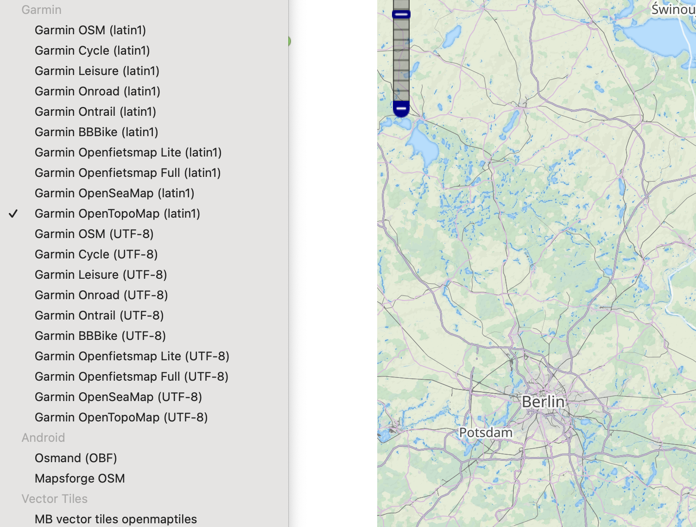
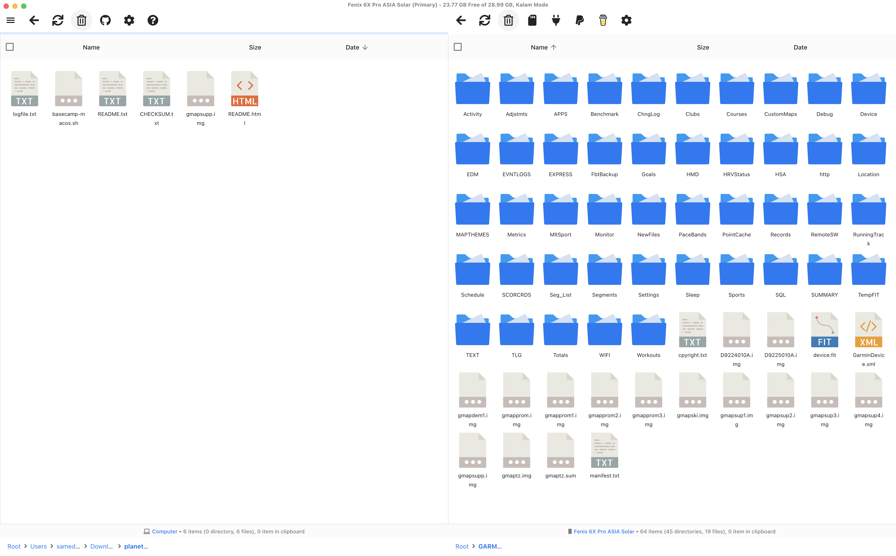

import Callout from '../../../components/Callout.astro'

## TL/DR

Download maps from [https://extract.bbbike.org/](https://extract.bbbike.org/). Use [https://github.com/ganeshrvel/openmtp](https://github.com/ganeshrvel/openmtp) to copy them from your Mac to your Garmin watch.

## Background

I was a happy Apple Watch user for several years, but eventually, the battery started to get really bad. My favourite feature of the Apple Watch was the alarm clock, but the battery was so bad that I could not depend on the watch lasting the night to wake me up.

I did research and decided to purchase a Garmin. They have very long battery life, and I thought it would be nice to have a watch that is less connected to the Apple ecosystem. I don't want any notifications on my watch.

I ended up finding the **Garmin Fenix 6X Pro Solar** on Facebook Marketplace. I was enjoying the multi-day battery life of the Fenix 6X, but I would never get the maps to work. Eventually, I realized that the watch was purchased originally in Asia and that it had Asian maps loaded on it. After looking into it, I saw that I could purchase more maps [from Garmin](https://www.garmin.com/en-US/p/1016/pn/010-D1752-00) for $130 USD, but there was no way to get maps from Garmin for free.

I had already paid a lot of money for the watch, so I was not keen on spending more on maps that I thought were included. This led to a bunch of searching and failed attempts. It is extra tricky if you have a Mac computer. So here are my instructions on how to add free maps to Garmin when you have a Mac computer! These instructions have only been tested with my Garmin Fenix 6X Pro Solar. Hopefully, they will work with your device as well.

## Downloading maps

I downloaded a map of the Pacific Northwest from [https://extract.bbbike.org/](https://extract.bbbike.org/). I tried two different formats. First, I downloaded "Garmin OpenTopoMap (UTF-8)". However, it never showed up when I copied this to my watch. I then tried "Garmin OpenTopoMap (latin1)". This did work! So I suggest first trying the maps that end with "(latin1)". Follow the steps on the website, and eventually, you will be emailed a link to download your map. Save the map to your computer.

## Copying Maps to Watch

To copy the maps from my Mac computer to my watch, I installed [https://github.com/ganeshrvel/openmtp](https://github.com/ganeshrvel/openmtp). Plug your watch into your computer in "OpenMTP" mode. Your watch files should show up on the right side, while your computer files will be on the left side. Copy the map file from your computer to the `/GARMIN` folder.

<Callout title="Other options I looked into for copying map files to watch">

Figuring out how to copy the map file from my Mac to my watch was tricky. I found lots of old blog posts that have outdated information. Here are a few of the other options I saw:

- "Android File Transfer" program: As of September 2024, this no longer seems to exist.
- [Commander One](https://commander-one.com/) file manager: This looks like a good option, but to connect to Garmin via "Android" mode, a paid license is required.
- [Garmin BaseCamp and Garmin MapInstall](https://www.garmin.com/en-CA/software/basecamp/): I could never get this working correctly. I am not sure why.
- [Garmin Express](https://www.garmin.com/en-CA/software/express/windows/): I also could not find a way to copy maps.

</Callout>

## Using the New Map on your Watch

Once the transfer is complete, unplug your watch. Wait a few seconds. Your watch should indicate that it is loading new maps. To use the map, navigate to *Settings* > *Activities & Apps* > *Hike* > *Hike Settings* > *Map* > *Configure Map*. Then select your new map. You know it is selected when the little sidebar is green. You should repeat the last step for each activity you want to use with your new map. My new map had a confusing name like this:

After enabling the new map, you should be ready to use free maps on your Garmin watch!

## References

I found these blog posts to be helpful:

- [https://hikingguy.com/hiking-gear/how-to-get-free-garmin-gps-maps-for-hiking/](https://hikingguy.com/hiking-gear/how-to-get-free-garmin-gps-maps-for-hiking/)
- [https://www.dcrainmaker.com/2019/08/installing-garmin-forerunner.html](https://www.dcrainmaker.com/2019/08/installing-garmin-forerunner.html)