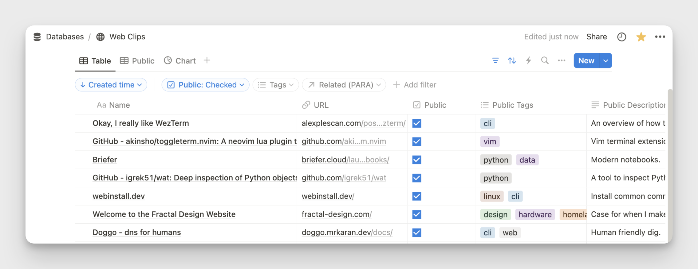
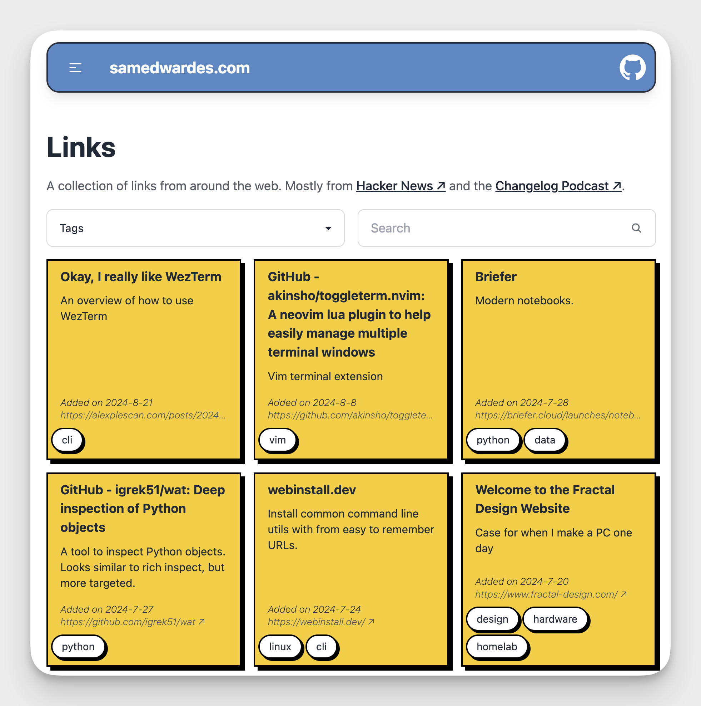
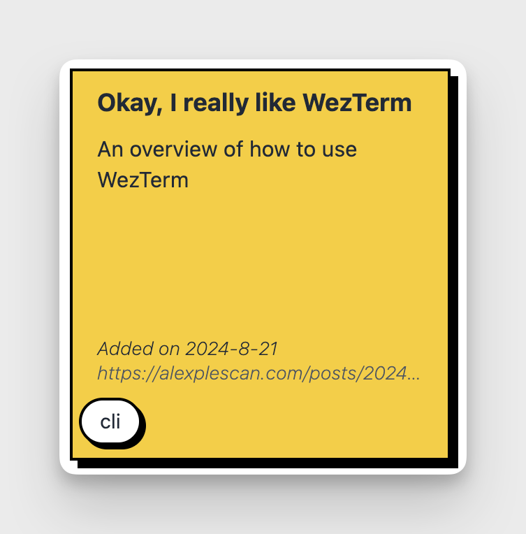
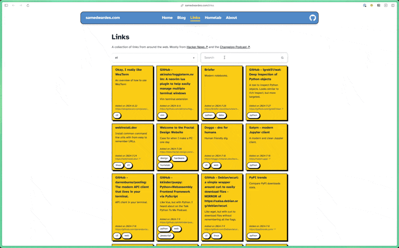

I am a big fan of Notion. I use it as my second brain and follow the [PARA](https://fortelabs.com/blog/para/) method to organize everything. One of my Notion databases is called "Web Clips". I use this database to save links that I find on the web.



I wanted to share some of the links I collect on my blog. I had a few options I was considering:

- ❌ I could make this Notion database public, but I want to keep some links private, so this was not a good option.
- ✅ I could use the [Notion API](https://developers.notion.com/docs/getting-started) to render all the links I want to show dynamically. This would be a lot of work, but that is what this blog is for. The finished result is here: [samedwardes.com/links](/links).

## Project Elements

I would need to build a few things to make this all work:

- A query that gets only the links I want to share publicly. The query should be able to optionally filter links based on a search field, tags, and other meta-data. See the [GitHub Repo](https://github.com/SamEdwardes/samedwardes.com/blob/b15a1dbd527dd029af06c3653c24139646f195c8/src/pages/links/partials/grid.astro#L17-L65) for the final query.

- I'd like to create a page that displays all the links. Since I have a lot of links, the page will also need pagination.
  
  

- A component to make each link look good.
  
  

You can see the final implementation of my code here: <https://github.com/SamEdwardes/samedwardes.com/tree/main/src/pages/links>.

## Workflow

My workflow is now like this:

I find a link I want to save. If I am on my computer, I use the [Notion extension](https://chromewebstore.google.com/detail/notion-web-clipper/knheggckgoiihginacbkhaalnibhilkk) to send the link to my "Web Clips" database. If I am on my iPhone, the Notion app has a built-in action in the "share tray" to send a page to the database.
By default, all links are private. If I want to share a link, I must opt-in to make it public. To do so, I check the "Public" field in Notion for that database item. I then enter more metadata, including "Public Tags" and "Public Description." These two fields will be rendered as part of the component.

Whenever someone visits <https://samedwardes.com/links>, a query is sent to the Notion API to render a page with all my links dynamically. If desired, the user can search all of my links through my website, which will modify the query and update the page.


## Astro

My website is built on Astro. As of August 2024, the entire site is statically generated except for `/links`. One of the parts I like about Astro is that you can opt to have some pages server-side rendered while other pages can be statically rendered. The `/links` page has to be server-side rendered every time because the links could change at any moment.

You can see how I implemented the links page here: <https://github.com/SamEdwardes/samedwardes.com/blob/main/src/pages/links/index.astro>. 

```bash
.
├── src
│   ├── pages
│   │   ├── links
│   │   │   ├── index.astro
│   │   │   └── partials
│   │   │       └── grid.astro
```

### `src/pages/links/index.astro`

This page "sets up the query" by getting all the tags I need to present to the user for filtering. It also makes the htmx calls that will handle the pagination.

```astro title="src/pages/links/index.astro"
---
import { Client } from "@notionhq/client";
import BrutalCard from "../../components/BrutalCard.astro";
import H1 from "../../components/H1.astro";
import DefaultLayout from "../../layouts/DefaultLayout.astro";

export const prerender = false;

// Query Notion to get the database so that I can get all of the possible tags.
const notion = new Client({
  auth: process.env.NOTION_TOKEN,
});

const database = await notion.databases.retrieve({
  database_id: "18594cc9dbcb4ca6984984f6beb03b81",
});

if (database.properties["Public Tags"].type !== "multi_select") {
  throw new Error("Public Tags property is not a multi_select");
}

const notionTags = database.properties["Public Tags"].multi_select.options.map(
  (option) => option.name,
);
---

<DefaultLayout metaTitle="Links">
  <H1>Links</H1>
  <p class="pb-4 prose max-w-full">
    A collection of links from around the web. Mostly from
    <a
      href="https://news.ycombinator.com/"
      target="_blank"
      class="after:content-['_↗']">Hacker News</a
    > and the <a
      href="https://changelog.com/"
      target="_blank"
      class="after:content-['_↗']">Changelog Podcast</a
    >.
  </p>
  <section
    hx-get="/links/partials/grid"
    hx-swap="innerHTML"
    hx-target="#notion-links-grid"
    hx-trigger="load"
  >
    <!-- Filters -->
    <div>
      <!-- Tags -->
      <div
        class="grid grid-cols-2 gap-4 pb-4"
        hx-get="/links/partials/grid"
        hx-swap="innerHTML"
        hx-target="#notion-links-grid"
        hx-trigger="change"
        hx-include="[name='tags'], [name='search']"
      >
        <select class="select select-bordered w-full" name="tags">
          <option disabled selected>Tags</option>
          <option>all</option>
          {notionTags.map((tag) => <option>{tag}</option>)}
        </select>
        <!-- Search -->
        <label class="input input-bordered flex items-center gap-2">
          <input type="text" class="grow" placeholder="Search" name="search" />
          <svg
            xmlns="http://www.w3.org/2000/svg"
            viewBox="0 0 16 16"
            fill="currentColor"
            class="h-4 w-4 opacity-70"
          >
            <path
              fill-rule="evenodd"
              d="M9.965 11.026a5 5 0 1 1 1.06-1.06l2.755 2.754a.75.75 0 1 1-1.06 1.06l-2.755-2.754ZM10.5 7a3.5 3.5 0 1 1-7 0 3.5 3.5 0 0 1 7 0Z"
              clip-rule="evenodd"></path>
          </svg>
        </label>
      </div>
    </div>
    <!-- Link cards -->
    <div
      class="grid grid-cols-1 sm:grid-cols-2 md:grid-cols-3 lg:grid-cols-4 gap-4"
      id="notion-links-grid"
    >
      <div class="col-span-full animate-pulse">
        <BrutalCard class="bg-gray-100">Loading Links...</BrutalCard>
      </div>
    </div>
  </section>
</DefaultLayout>

```

### `src/pages/links/partials/grid.astro`

This page is where the query primary Notion query to get the links is executed. The JavaScript queries my Notion database and then renders a grid nested into `src/pages/links/index.astro`.

```astro title="src/pages/links/partials/grid.astro"
---
// Ideally I would set this to partial = true, but I found the tailwind styles
// do not ship when I do this.
export const partial = false;
export const prerender = false;

import { Client, isFullPage } from "@notionhq/client";
import NotionLinkCard from "../../../components/NotionLinkCard.astro";
import BrutalCard from "../../../components/BrutalCard.astro";

const cursor = Astro.url.searchParams.get("cursor");
const searchQuery = Astro.url.searchParams.get("search");
const tagsQuery = Astro.url.searchParams.get("tags");

// -----------------------------------------------------------------------------
// Call Notion API
// -----------------------------------------------------------------------------
const notion = new Client({
  auth: process.env.NOTION_TOKEN,
});

const queryFilters = {
  and: [
    {
      property: "Public",
      checkbox: {
        equals: true,
      },
    },
    {
      property: "Public Tags",
      multi_select: {
        contains: tagsQuery && tagsQuery != "all" ? tagsQuery : "",
      },
    },
    {
      property: "Name",
      rich_text: {
        contains: searchQuery ? searchQuery : "",
      },
    },
  ],
};

// console.log(queryFilters.and[1].multi_select);
// console.log(queryFilters.and[2].rich_text);

if (cursor) {
  var fullOrPartialPages = await notion.databases.query({
    // Webclips URL: https://www.notion.so/samedwardes/18594cc9dbcb4ca6984984f6beb03b81?v=bcb531df9d15439eb5130e8723583f6c&pvs=4
    database_id: "18594cc9dbcb4ca6984984f6beb03b81",
    start_cursor: cursor,
    page_size: 13,
    filter: queryFilters,
  });
} else {
  var fullOrPartialPages = await notion.databases.query({
    // Webclips URL: https://www.notion.so/samedwardes/18594cc9dbcb4ca6984984f6beb03b81?v=bcb531df9d15439eb5130e8723583f6c&pvs=4
    database_id: "18594cc9dbcb4ca6984984f6beb03b81",
    page_size: 13,
    filter: queryFilters,
  });
}

// -----------------------------------------------------------------------------
// Extract data from Notion API response
// -----------------------------------------------------------------------------

// Type guards for property types
function isCheckboxProperty(property: any): property is { checkbox: boolean } {
  return property?.type === "checkbox";
}

function isTitleProperty(
  property: any,
): property is { title: [{ plain_text: string }] } {
  return property?.type === "title";
}

function isUrlProperty(property: any): property is { url: string } {
  return property?.type === "url";
}

function isFormulaStringProperty(
  property: any,
): property is { formula: { string: string } } {
  return property?.type === "formula" && property.formula.type === "string";
}

function isMultiSelectProperty(
  property: any,
): property is { multi_select: { name: string }[] } {
  return property?.type === "multi_select";
}

function isRichTextProperty(
  property: any,
): property is { rich_text: [{ plain_text: string }] } {
  return property?.type === "rich_text";
}

export interface PageLink {
  id: string;
  created_time: Date;
  publiclyVisible: boolean;
  title: string;
  url: string;
  base_url: string;
  tags: string[];
  description?: string;
}

// Refactored function to extract page link
function extractPageLink(page: any): PageLink {
  if (!isFullPage(page)) throw new Error("Not a full page object");

  const {
    Public: publicProp,
    Name: nameProp,
    URL: urlProp,
    "Base URL": baseUrlProp,
    "Public Tags": tagsProp,
    "Public Description": descriptionProp,
  } = page.properties;

  if (
    !isCheckboxProperty(publicProp) ||
    !isTitleProperty(nameProp) ||
    !isUrlProperty(urlProp) ||
    !isFormulaStringProperty(baseUrlProp)
  ) {
    throw new Error("Invalid property types");
  }

  const publiclyVisible = publicProp.checkbox;
  const title = nameProp.title[0]?.plain_text ?? "";
  const linkURL = urlProp.url ?? "";
  const base_url = baseUrlProp.formula.string ?? "";
  const tags = isMultiSelectProperty(tagsProp)
    ? tagsProp.multi_select.map((tag) => tag.name)
    : [];
  const description = isRichTextProperty(descriptionProp)
    ? descriptionProp.rich_text[0]?.plain_text
    : undefined;

  return {
    id: page.id,
    created_time: new Date(page.created_time),
    publiclyVisible,
    title,
    url: linkURL,
    base_url,
    tags,
    description,
  };
}

// Use the refactored function in the map
const pageLinks = fullOrPartialPages.results
  .map(extractPageLink)
  .sort((a, b) => b.created_time.getTime() - a.created_time.getTime());
---

{
  pageLinks.map((page) => {
    return (
      <NotionLinkCard
        url_to_page={page.url}
        title={page.title}
        description={page.description ? page.description : null}
        created_time={page.created_time}
        tags={page.tags}
      />
    );
  })
}

{
  fullOrPartialPages.next_cursor ? (
    <BrutalCard
      hx-get={`/links/partials/grid?cursor=${fullOrPartialPages.next_cursor}&tags=${tagsQuery ? tagsQuery : ""}&search=${searchQuery ? searchQuery : ""}`}
      hx-swap="outerHTML"
      hx-target="this"
      hx-trigger="revealed"
      class="animate-pulse bg-gray-100"
    >
      Loading more links...
    </BrutalCard>
  ) : (
    <BrutalCard class="bg-gray-200 col-span-full">End of links</BrutalCard>
  )
}

```
## htmx

I use [htmx](https://htmx.org/) to handle the pagination. I could not find a clean way to do this in just Astro, and I was already familiar with htmx so I thought I would give it a try. The end result is pretty easy to reason about and maintain.

The easiest way to understand the htmx implementation is to review the code: <https://github.com/SamEdwardes/samedwardes.com/tree/main/src/pages/links>. In short, on the `index.astro page`:

- When the page first loads, htmx makes a request to `/links/partials/grid` to render the initial grid.
- When a filter changes, the entire grid is "reset" and replace with an updated query.

```html title="src/pages/links/index.astro"
  <section
    hx-get="/links/partials/grid"
    hx-swap="innerHTML"
    hx-target="#notion-links-grid"
    hx-trigger="load"
  >
    <!-- Filters -->
    <div>
      <!-- Tags -->
      <div
        class="grid grid-cols-2 gap-4 pb-4"
        hx-get="/links/partials/grid"
        hx-swap="innerHTML"
        hx-target="#notion-links-grid"
        hx-trigger="change"
        hx-include="[name='tags'], [name='search']"
      >

...

    <!-- Link cards -->
    <div
      class="grid grid-cols-1 sm:grid-cols-2 md:grid-cols-3 lg:grid-cols-4 gap-4"
      id="notion-links-grid"
    >
      <div class="col-span-full animate-pulse">
        <BrutalCard class="bg-gray-100">Loading Links...</BrutalCard>
      </div>
    </div>


```

The `grid.astro` partial handles the pagination. When the bottom of the page is reached, the query is triggered again to get the next page.

```astro title="src/pages/links/partials/grid.astro"

{
  fullOrPartialPages.next_cursor ? (
    <BrutalCard
      hx-get={`/links/partials/grid?cursor=${fullOrPartialPages.next_cursor}&tags=${tagsQuery ? tagsQuery : ""}&search=${searchQuery ? searchQuery : ""}`}
      hx-swap="outerHTML"
      hx-target="this"
      hx-trigger="revealed"
      class="animate-pulse bg-gray-100"
    >
      Loading more links...
    </BrutalCard>
  ) : (
    <BrutalCard class="bg-gray-200 col-span-full">End of links</BrutalCard>
  )
}
```

## Demo

Visit [samedwardes.com/link](https://samedwardes.com/links) or watch the GIF below to see it in action.


