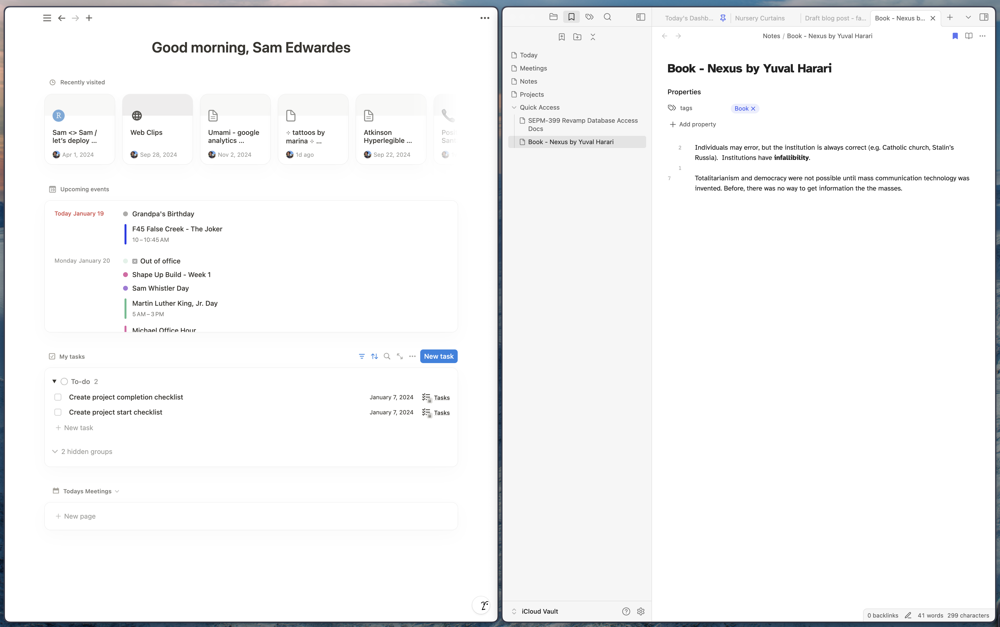
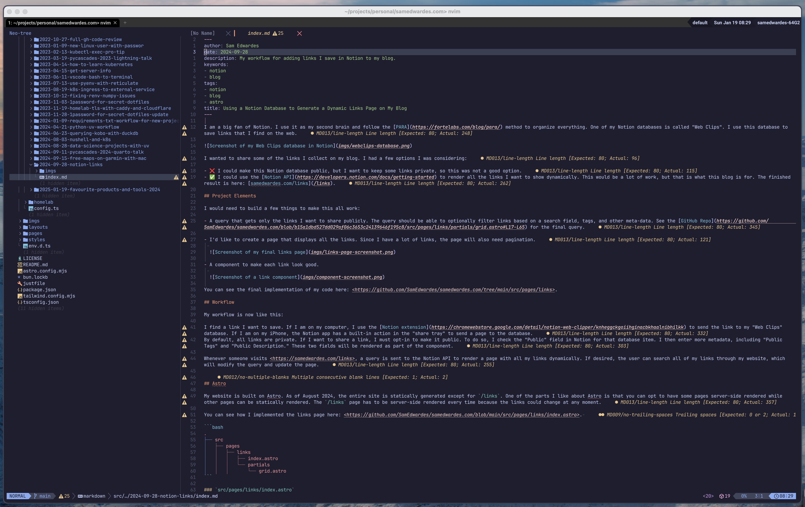
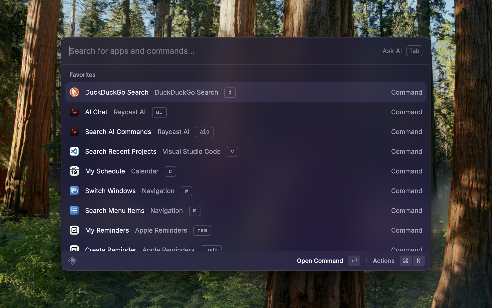
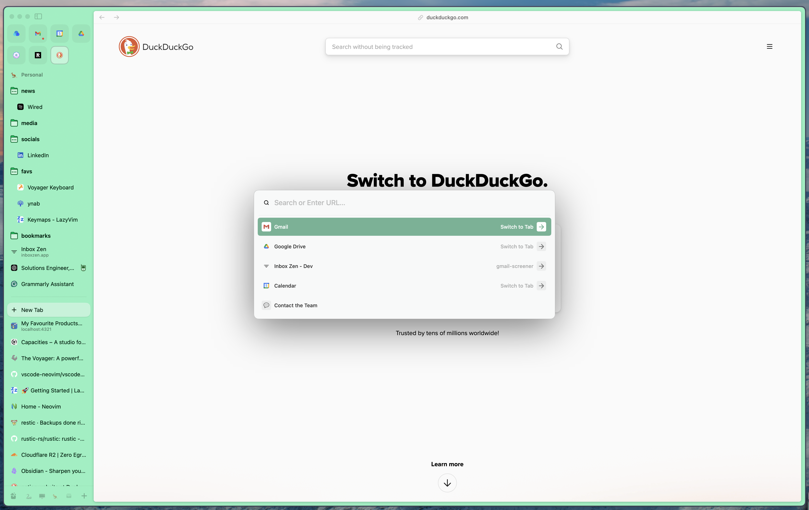

This year, I tried several new products that I enjoyed. Here is a summary of my favourite new products (new to me) that I started using in 2024.

- ZSA Voyager Keyboard
- Obsidian ~~Notion~~
- Neovim
- Raycast ~~Alfred~~
- uv ~~Poetry and pipx~~
- Readwise Reader ~~Omnivore~~
- Castro Podcast App
- Arc Web Browser ~~Vivaldi~~

## ZSA Voyager Keyboard

Without question, this is my top pic. My [ZSA Voyager](https://www.zsa.io/voyager) keyboard has been a game-changer. The ability to use layers, home-row mods, ergonomics, and the design/build quality make this a fantastic product. There is a steep learning curve, but it is already paying off. You can check out my layout here: <https://configure.zsa.io/voyager/layouts/WgnAj>. If you are interested in ZSA or Ergonomic keyboards, The Changelog Podcast recently had Erez Zukerman on episode [#608](https://changelog.com/podcast/608).

<!-- TODO: add pics of my keyboard -->

## Obsidian

I made the switch from [Notion](https://notion.so) to [Obsidian](https://obsidian.md/) in 2024. I was happy with Notion, but it was starting to get slow (I had more than 5,000 pages), did not support Vim motions, and did not like all of the AI features Notion was adding. I wanted to know if I could get all the note-taking features I cared about at a cheaper price.

I did research and found several tools that I considered, mainly [Obsidian](https://obsidian.md/) and [Capacities](https://capacities.io/). Since Obsidian has been around for a long time and has an active community, I decided to try it.

It took me a while to adapt my Notion workflow to Obsidian, but now that I am a few months in, I am very happy. Obsidian is really fast since everything is local. I started to learn Vim this year, so I appreciated the built-in Vim keybindings.

The only pain point I have with Obsidian now is syncing. Obsidian does provide a syncing service. However, I would require the Sync Plus plan with 100 GB of storage, costing $192 USD per year. Right now, I am using iCloud to sync my vault. It works OK. The startup on my phone is slow, and I worry I might one day lose some notes. But so far, no significant problems. I back up my notes to [Cloudflare R2](https://www.cloudflare.com/developer-platform/products/r2/) using [Restic](https://restic.net/) 4 times per day, so if I ever do lose notes it should be easy to restore.

## Neovim

In 2024, I decided to learn Vim. It has been a long journey, but I eventually landed on using [NeoVim](https://neovim.io/) with [LazyVim](https://www.lazyvim.org/). NeoVim is the editor, and LazyVim is a "distribution" that sets up NeoVim with reasonable default settings and plugins. I have also "Vimified" a few other tools in my life, including VS Code with the [NeoVim Extension](https://github.com/vscode-neovim/vscode-neovim), Obsidian with Vim keybindings, and my browser with the [Vimium](https://chromewebstore.google.com/detail/vimium/dbepggeogbaibhgnhhndojpepiihcmeb) extension.

You can check out my Neovim configuration here: <https://github.com/SamEdwardes/lazyvim-config>.

## Raycast

I made the switch from [Alfred](https://www.alfredapp.com/) to [Raycast](https://www.raycast.com/). I didn't encounter any significant problems with Alfred, but when I saw a lot of content created around Raycast, I decided to try it. There are a few reasons I chose to stick with Raycast. I like how Raycast takes a more code-first approach to writing extensions (e.g., Raycast Scripts). In Alfred, you can run scripts but have to mess around with their user interface to define inputs and outputs. I also really like Raycast's AI integrations. I use the AI features all the time and find that they work well. I even upgrade to Raycast Pro.

If you are interested in trying Raycast, here are a few of my referral codes you can use:

- <https://www.raycast.com/hey/12e4239d>
- <https://www.raycast.com/hey/12e890f6>
- <https://www.raycast.com/hey/37aaa084>
- <https://www.raycast.com/hey/3f8d6863>

## uv

[Uv](https://docs.astral.sh/uv/) has been a game changer for my Python work. It has replaced several other tools for me:

- [Poetry](https://python-poetry.org/): I now use uv to manage my projects instead of poetry. The workflows are similar (e.g. `uv add pands` vs. `poetry add pandas`), but uv is much faster.
- [Pipx](https://pipx.pypa.io/latest/): I now use `uvx` or `uv tool install` to install and run Python-based CLI tools. Pipx met this need perfectly before, but uv does all the same things much faster (e.g. `uvx bpytop` vs. `pipx run bpytop`).

Does speed really matter? In my experience, yes, it does. I spend a fair amount of time working on remote machines that are much slower than my MacBook Pro. On these lower-end machines, you really notice the difference in speed.

## Readwise Reader

I was a dedicated [Omnivore](https://omnivore.app/) user. Sadly, they decided to close up shop this year and did not provide a viable path to self-hosting: [Omnivore is joining ElevenLabs - Omnivore Blog](https://blog.omnivore.app/p/omnivore-is-joining-elevenlabs). I looked at a few different "read it later" apps and ended up going with [Readwise Reader](https://readwise.io/read). I was initially skeptical because of the high price tag of $149.99 CAD per year. But after the free trial, I decided to bite the bullet. I could see myself leaving in the future because of the high price, but I am really enjoying Reader for now. The web app has a great design, and I like the "power user" keyboard shortcuts. The IOS app is similarly well designed. I also found that it is good at extracting articles from pages. For example, Omnivore did not always extract New York Times articles. Lastly, I like the text-to-voice feature. It is helpful to be able to listen to my articles instead of reading all of them.

## Castro podcast app

Like Readwise, I did not think I would become a regular [Castro](https://castro.fm/) user. The main downside of Castro is the design is not great. It looks old and outdated compared to the Apple Podcast player. But I like the workflow that Castro offers. Their big innovation is the implementation of a queue:

> The magic of Castro podcast app is a single playlist that gives you total control over your listening experience. We call it the Queue. While most podcast apps treat every show the same, Castro podcast app lets you manage your relationship with each show on an individual basis.
>
> Your favorite shows get downloaded and added to the queue automatically, while shows you like to be more choosy with get added to an Inbox you can browse later.

I like how my favourite shows, which I always listen to, are directly added to the queue, while shows that I sometimes listen to first are added to my "inbox," where I will later decide if they go into the queue. If a better-designed app with similar functionality came out, I could see myself switching, but for now, I am sticking to Castro.

## Arc Web Browser

My last pic is the most controversial. [Arc](https://arc.net/) is an excellent web browser. Still, in late 2024, the company behind Arc released a video ([What have we been up to? (CEO Update)](https://www.youtube.com/watch?v=E9yZ0JusME4)) announcing that they put Arc in maintenance mode and focus on developing a new browser. What does this mean for the future of Arc? The Browser Company has promised to continue caring for Arc but no longer focuses on shipping new features. Time will tell if this promise holds true.

Before Arc, I was using [Vivaldi](https://vivaldi.com/). I switched to Arc because many people at work were using it, and I wanted to try something new. Vivaldi is excellent, and I will switch back if Arc starts to go downhill, but I prefer Arc for a few reasons. Compared to Vivaldi, I like Arc's minimalist and clean design. I also like how Arc implemented the concept of "profiles" and "spaces". I can quickly switch between "Work", "Demo", and "Personal" profiles. Within each profile, I create multiple spaces to organize my work. I also really like the Arc's IOS app "[Arc Search](https://apps.apple.com/us/app/arc-search-find-it-faster/id6472513080)". It has a clean UI that I find snappy to use and syncs with Arc desktop.

