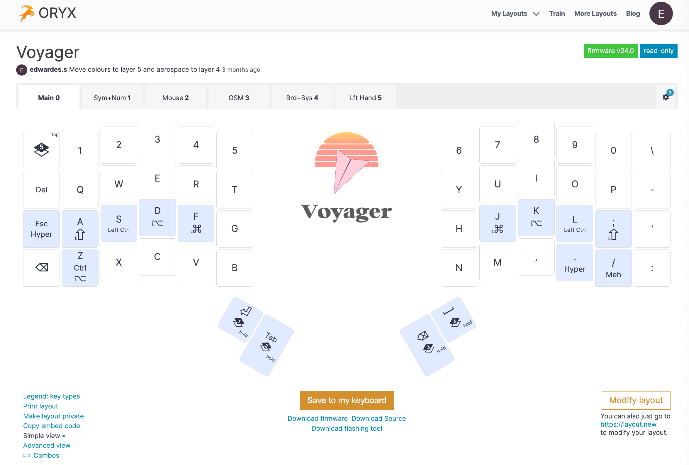

## TL/DR

I have been on a mission to use my mouse less and keyboard more. Using the keyboard instead of the mouse is more ergonomic, efficient, and fun. The best tools I have found are the [ZSA Voyager Keyboard](https://www.zsa.io/voyager), home row mods, [Shortcat](https://shortcat.app/), [Vimium](https://chromewebstore.google.com/detail/vimium/dbepggeogbaibhgnhhndojpepiihcmeb), [Aerospace](https://nikitabobko.github.io/AeroSpace/guide#), Vim grammar (many applications support it), [Raycast](https://www.raycast.com/), and [Karabiner Elements](https://karabiner-elements.pqrs.org/).

## ZSA Voyager and ORYX

The most important part of my no-mouse setup is the [ZSA Voyager](https://www.zsa.io/voyager). This Voyager is a low-profile, split ergonomic keyboard. The ORYX software for the Voyager unlocks its real power. With ORYX, you can fully customize what every key does and create multiple layers. Using ORYX, you can configure keys that move and click the mouse. You can see my current layout here: <https://configure.zsa.io/voyager/layouts/WgnAj/latest/0>.



## Home Row Mods

Home row mods mean putting your modifier keys on the home row. On a Mac, the modifier keys are <kbd>⌘ Command</kbd>, <kbd>⌥ Option</kbd>, <kbd>⌃ Control</kbd>, and <kbd>⇧ Shift</kbd>. The home row are the keys that your fingers touch when in the "ready" position. When you put mods on your home row, it is usually easier to execute shortcuts. For example, <kbd>⌘ Command</kbd> + <kbd>b</kbd> becomes hold <kbd>j</kbd> + <kbd>b</kbd>.

Like most of these changes, adjusting to home row mods can take a while. It is easy to accidentally trigger the modifier by holding a home row key for too long. But after practice, you will become more accurate, and for me, I eventually became more efficient.

## Shortcat and Vimium

[Shortcat](https://shortcat.app/) and [Vimium](https://chromewebstore.google.com/detail/vimium/dbepggeogbaibhgnhhndojpepiihcmeb) allow you to move your cursor and click with only the keyboard. You don't need to use both. Shortcat works everywhere, Vimium only works in the browser. I like to use both because Vimium unlocks some extra features in the browser, like scrolling with the <kbd>j</kbd> and <kbd>k</kbd> keys. If you are just getting started, I recommend starting with Shortcat because it works with more applications and is easier to get started with.

## Aerospace

[Aerospace](https://nikitabobko.github.io/AeroSpace/guide#) is a tiling window manager. When new windows open, it automatically arranges all of the windows on your screen so that everything fits side by side. I like Aerospace because it is scriptable and customizable. You customize all keyboard shortcuts and write scripts to set up layouts quickly.

## Vim Grammar

Vim grammar is not itself a tool but a standard set of keyboard shortcuts and a way of working with text that many applications implement, most notably Vim. It has a steep learning curve but also a big payoff.

The basics of the grammar are: `verb` (operators) + `noun` (motions). For example:

```
j            # move down
10j          # move down 10 lines
$            # end of the line
w            # move forward to the beginning of the next word
3w           # move forward 3 words
gg<shift>vG  # Go to the top, select the line, select to the bottom (AKA select all)
```

NeoVim, VS Code, Positron, Obsidian, Gmail, and Arc (via Vimium) are the applications I use the most that support Vim grammar. Vim grammar is a huge plus for me now when choosing new software.

## Raycast

[Raycast](https://www.raycast.com/) replaces the Mac's built-in Spotlight search. It does everything Spotlight can do, plus much more. With Raycast, you can perform tasks that would otherwise require the mouse. For example, Raycast has commands to mute, decrease, or increase the volume.

## Karabiner Elements

[Karabiner Elements](https://karabiner-elements.pqrs.org/) is a Mac app that can remap any key on your keyboard. I prefer to use ORYX/ZSA to remap keys, but that only works when using my ZSA keyboard. The benefit of Karabiner Elements is that it works with my Mac's built-in keyboard. Here are a few of my most useful remappings:

- Tap <kbd>Caps Lock</kbd> to <kbd>Escape</kbd>
- Hold <kbd>Caps Lock</kbd> to <kbd>⌘ Command</kbd> + <kbd>⌥ Option</kbd> + <kbd>⌃ Control</kbd> + <kbd>⇧ Shift</kbd>(Hyper Key)
- Arrow keys:
  - Left: <kbd>⇧ Hyper</kbd> + <kbd>h</kbd>
  - Right: <kbd>⇧ Hyper</kbd> + <kbd>l</kbd>
  - Down: <kbd>⇧ Hyper</kbd> + <kbd>j</kbd>
  - Up: <kbd>⇧ Hyper</kbd> + <kbd>k</kbd>
- Hold <kbd>Tab</kbd> to <kbd>⌃ Control</kbd>
- Hold <kbd>Return</kbd> to <kbd>⌘ Command</kbd>
- Hold <kbd>Fn</kbd> to <kbd>⇧ Shift</kbd> + <kbd>⌥ Option</kbd>

Karabiner can be complex. If you want something simpler, [Superkey](https://superkey.app/) is a good option to remap some keys for common use cases.
