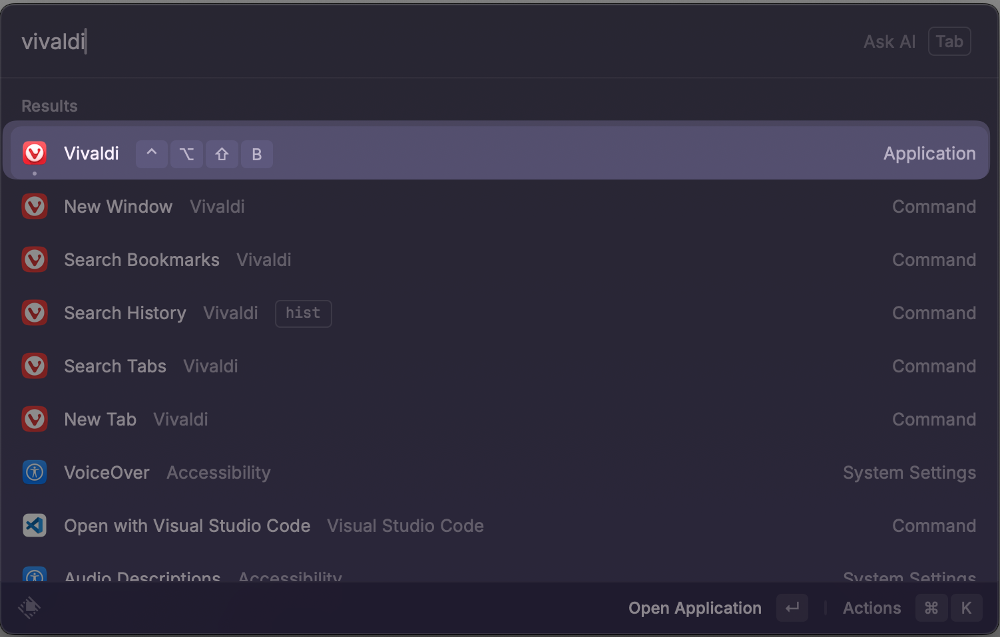
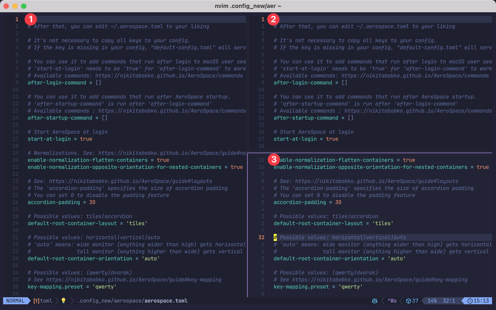

I use a lot of keyboard shortcuts on my computer. I try to use the mouse as little as possible. It would be really challenging to remember all the shortcuts I use on a daily basis. Instead of raw memorization, I use a set of consistent patterns/strategies to make it easier to remember all the shortcuts I use. There is still a lot of memorization involved, but this strategy helps simplify it.

## Top level categories

- Navigation: <kbd>h</kbd>, <kbd>j</kbd>, <kbd>k</kbd>, <kbd>l</kbd>
- Launching applications: <kbd>Meh</kbd>
- Raycast commands: <kbd>Hyper</kbd>
- Managing windows with Aerospace: <kbd>⌥ Option</kbd>
- Managing panes (e.g. Neovim Windows): <kbd>^ Control</kbd>

In my experience using <kbd>Meh</kbd>, <kbd>Hyper</kbd>, <kbd>Option</kbd>, and <kbd>⌃ Control</kbd> typically avoids conflicts with application specific shortcuts that usually involve <kbd>⌘ Command</kbd> and/or <kbd>⌘ Command</kbd> + <kbd>⇧ Shift</kbd>.

## Navigation (left, right, up, down)

At the core of my workflow are the Vim navigation keys.

- left: <kbd>h</kbd>
- down: <kbd>j</kbd>
- up: <kbd>k</kbd>
- right: <kbd>l</kbd>

Whenever an action involves a specific direction, I always use the Vim navigation keys along with some other modifier.

## Launching applications

The apps that I use most commonly can be launched with the <kbd>Meh</kbd> key. "Meh" is shorthand for <kbd>⌥ Option</kbd> + <kbd>⌃ Control</kbd> + <kbd>⇧ Shift</kbd> Here are a few examples:

- Vivaldi (web **b**rowser): <kbd>Meh</kbd> + <kbd>b</kbd>
- **O**bsidian: <kbd>Meh</kbd> + <kbd>o</kbd>
- **W**ezterm: <kbd>Meh</kbd> + <kbd>w</kbd>

Where ever possible I use mnemonics so it is easy to remember. I configure the shortcuts using Raycast.

## Raycast commands

In addition to launching applications, I also use Raycast to invoke a bunch of shortcuts. Raycast is the shortcuts are always invoked with the <kbd>Hyper</kbd>. "Hyper" is shorthand for <kbd>⌘ Command</kbd> + ⌥ Option + ⌃ Control + ⇧ Shift. I try to choose a mnemonic that helps me remember the shortcut. Here are a few examples.

- Fix spelling and **g**rammar: <kbd>Hyper</kbd> + <kbd>g</kbd>
- Open Raycast **c**alendar: <kbd>Hyper</kbd> + <kbd>c</kbd>
- Search **m**enu items: <kbd>Hyper</kbd> + <kbd>m</kbd>

## Managing windows with Aerospace

Moving between and organizing windows is done with Aerospace. All of (or at least most) of my Aerospace shortcuts are mapped to <kbd>⌥ Option</kbd>.

- Focus on window to the left: <kbd>⌥ Option</kbd> + <kbd>h</kbd>
- Focus on window to the right: <kbd>⌥ Option</kbd> + <kbd>l</kbd>
- Focus on window above: <kbd>⌥ Option</kbd> + <kbd>k</kbd>
- Focus on window below: <kbd>⌥ Option</kbd> + <kbd>j</kbd>

When ever moving left, right, up, or down is involved I try to incorporate the vim navigation keys. This does complicate things sometimes because I also wanted to use the Vim navigation keys for swapping paints. To handle this, I modify option with shift for swapping windows and aerospace.

- Focus on window to the left: ⌥ Option + <kbd>⇧ Shift</kbd> + <kbd>h</kbd>
- Focus on window to the right: <kbd>⌥ Option</kbd> + <kbd>⇧ Shift</kbd> + <kbd>l</kbd>
- Focus on window above: <kbd>⌥ Option</kbd> + <kbd>⇧ Shift</kbd> +<kbd>k</kbd>
- Focus on window below: <kbd>⌥ Option</kbd> + <kbd>⇧ Shift</kbd> + <kbd>j</kbd>

## Managing panes

Some of the applications I use support multiple panes. For example, in Neovim you can have several panes open.

To move between panes, I use <kbd>⌃ Control</kbd> as my prefix, with the vim navigation keys.

- Focus on pane to the left: <kbd>⌃ Control</kbd> + <kbd>h</kbd>
- Focus on pane to the right: <kbd>⌃ Control</kbd> + <kbd>l</kbd>
- Focus on pane above: <kbd>⌃ Control</kbd> + <kbd>k</kbd>
- Focus on pane below: <kbd>⌃ Control</kbd> + <kbd>j</kbd>

In my web browser, I have mapped <kbd>⌃ Control</kbd> + <kbd>j</kbd> and <kbd>⌃ Control</kbd> + <kbd>k</kbd> to move between tabs, and <kbd>⌃ Control</kbd> + <kbd>h</kbd> and <kbd>⌃ Control</kbd> + <kbd>l</kbd> to navigate between [workspaces](https://vivaldi.com/features/workspaces/).
